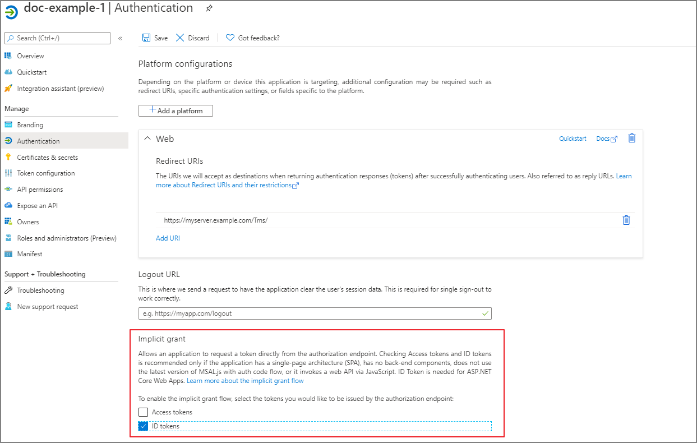
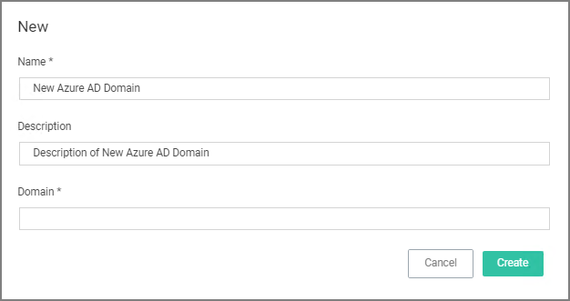
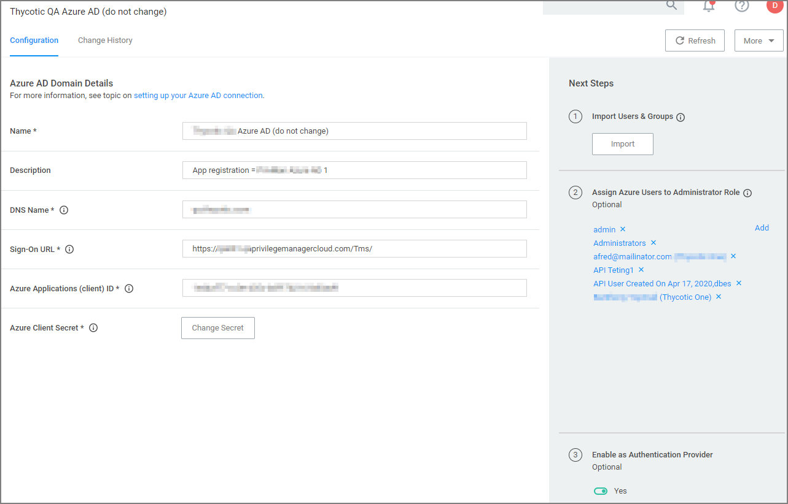
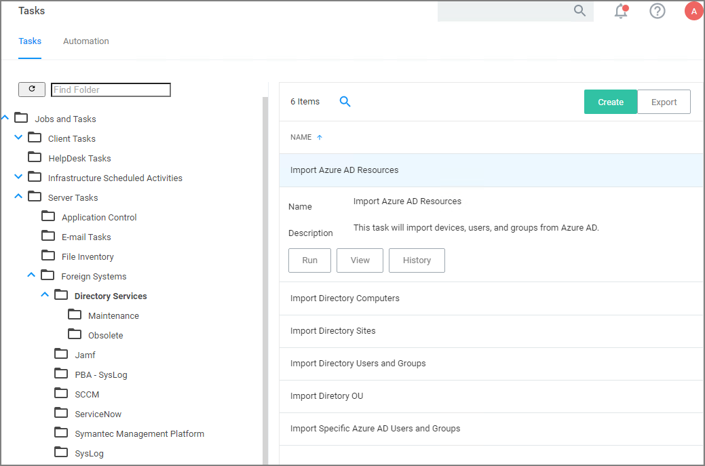
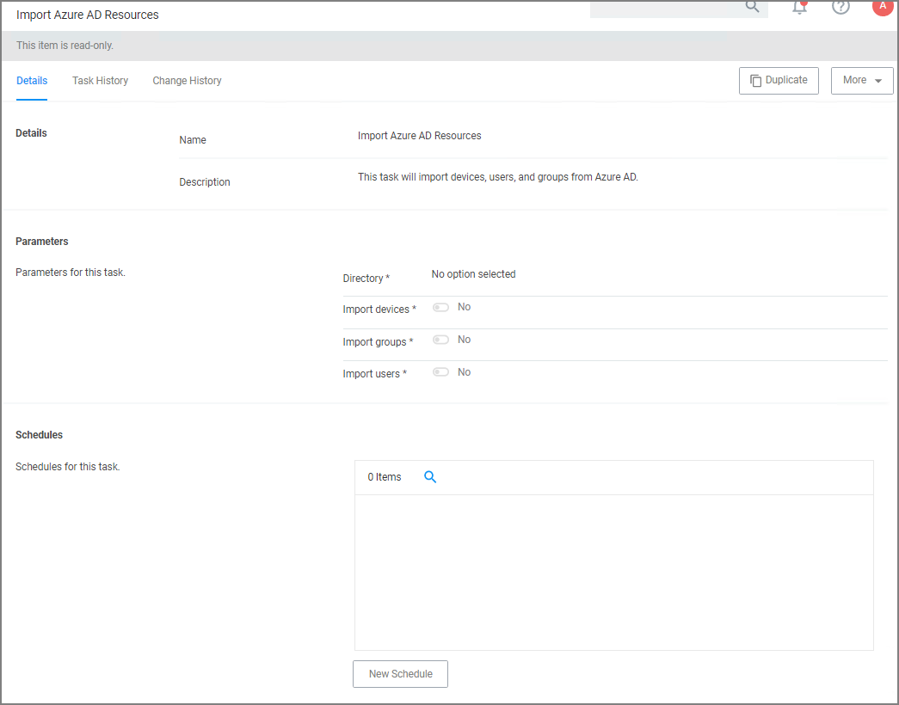

[title]: # (Set Up Azure Active Directory Integration in Privilege Manager)
[tags]: # (Azure AD,integration,Privilege Manager)
[priority]: # (4)
# Setting Up Azure Active Directory Integration in Privilege Manager

Setting up Azure AD integration with Privilege Manager requires steps in your Azure tenant and in Privilege Manager.

In Privilege Manager the Azure Active Directory Domain Foreign System requires the following from the Azure Portal:

* Tenant (this is the unique identifier of the Azure Active Directory instance)
* Application ID (an application registration in the directory instance)
* Client Secret (this is found in Certificates & Secrets in the Azure portal for the previously created application registration)

This documentation assumes that you are familiar with the Azure Portal and know how to navigate it in order to setup or retrieve the above information for configuration with your Privilege Manager instance.

Setting up Azure AD Integration in Privilege Manager requires these components independent of On-premises or Cloud:

* User Credential
* An Azure Active Directory Domain Foreign System
* Executing a Privilege Manager Task (Import Users and Groups)
* Creating a Scheduled Task to synchronize the users and groups on a regular basis

>**Note**:
>You do not need to have an active directory domain before you can sync with an Azure Active Directory. However, there are benefits for synchronizing on-premises Active Directory to Azure AD.

## Prerequisites

Assign Azure user(s) to the __Privilege Manager Administrators__ Role. In order for users to authenticate via Azure AD, they need to be members of various roles. There must be at least one member from your Azure Directory to be allowed to login via Azure AD before you can continue. We recommend adding yourself to ensure that you can login after the Authentication Provider is configured.

## Setting up Azure AD with Privilege Manager

### Steps in the Azure Portal

1. Navigate to your Azure Portal: [https://portal.azure.com](https://portal.azure.com)
1. In your Azure portal, navigate to and open __Azure Active Directory__.
1. Verify you are in the right tenant or use __Switch Tenant__ to switch to another tenant in your organization.
1. Under __Create__ select __App registration__.
1. Under __Register an application__, enter
   1. an application __Name__.
   1. select __Supported account types__ based on your business requirements.
   1. specify the following Redirect URI values using the URI of your Privilege Manager server:
      https://myserver.example.com/TMS/

      >**Note**:
      >This URI does not need to be a publicly visible address. It is only used in redirecting the browser back to the Privilege Manager web application after authentication.
      >For Privilege Manager Cloud subscriptions, the URI should be pointed to the URI that was set up for you, for example: https://myassignedname.privilegemanagercloud.com/Tms/

   1. Click the __Register__ button.
1. Navigate to your newly created application registration.
1. Enter these additional URIs in the Redirect URI field:
      * https://myserver.example.com/Tms/Account/Signout/
      * https://myserver.example.com/Tms/Account/SignoutCallback/
1. On the __Platform configurations__ page under the __Implicit grant and hybrid flows__ area, check the box labeled __ID tokens__.

   
1. Under __Manage__, select __API Permissions__.
1. Click the __+ Add a permission__ option to add the Microsoft Graph API.
1. As permission type, select __Application permissions__.
1. Expand __Directory__, select __Directory.Read.All__  and click __Add permissions__.
1. Click the __+ Add a permission__ option to add the __Azure Active Directory Graph API__.
1. As permission type, select __Application permissions__.
1. Expand __Directory__, select __Directory.Read.All__ and click __Add permissions__.

   Both API permissions must be granted by the domain administrator before the application can use this registration. Once this is done, these permissions will show a green check box.
1. Under __Manage__, select __Certificates & secrets__.  
1. Click __+ New client secret__.  
1. Add a __Description__ and chose an __Expires__ setting based on your business requirements.
1. Click __Add__ to create the secret.
1. Use the __Copy to clipboard__ icon to copy the newly created secret to the clipboard.

You will need the Application Id and the Client Secret you copied to the clipboard in Privilege Manager to complete the setup.

## Steps in your Privilege Manager Instance

### Set-up Foreign Systems

1. Select __Admin | Configuration__.  
1. Select the __Foreign Systems__ tab.
1. Select __Azure Active Directory Domains__.
1. Click __Create__.  

   
1. Enter a Name, Description, and Domain, which is the DNS name of the Tenant from the Azure Portal identified at the beginning of this document. 
1. Click the __Create__.

   
1. Verify the __Sign-on URL__ is correct. This value should match what was specified in the Redirect URI option when setting up the Application Registration.
1. Enter the __Azure Application (client) ID__. This is the Application ID that was created when registering your application in the Azure Portal.
1. Click __Save Changes__.
1. Continue to the Azure AD Authentication Provider section and click __Edit__.
1. Complete the three steps:
   1. Import Users & Groups from Azure AD. This process may take a few minutes to complete, depending on the size of the directory. Privilege Manager offers two tasks for this import:

      * __Default Import AzureAD Users/Groups__, imports ALL users and groups.
      * __Import Specific Azure AD Users and Groups__, imports only the specified users and/or groups.

      Refer to setup and scheduling of these tasks under the "Import Users and Groups via Privilege Manager Task" and "Create Scheduled Task for Users/Groups Synchronization" topics below.
   1. Assign Azure user(s) to the Privilege Manager Administrators Role. In order for users to authenticate via Azure AD, they will need to be added as members of various roles. There must be at least one member from this Azure Directory allowed to login via Azure AD before you can continue. We recommend adding yourself to ensure that you can login after the Authentication Provider is configured.
   1. Set as Authentication Provider.
1. Click __Save Changes__.

### Viewing Imported Users and Groups

You may verify and browse the users and groups that are expected to be imported from Azure Active Directory.

1. In Privilege Manager, navigate to __Admin | Resources__.
1. Expand __Organizational Views__.
1. Expand __Default__.
1. Expand __All Resources__.
1. Expand __Security Principal__.
1. Select __Domain Users__. You should see a list that contains imported Azure AD users.
1. Select __User Group__. You should see a list that contains imported Azure AD groups (other groups may exist in the list as well).

### Import Users and Groups via Privilege Manager Task

This step was performed initially as part of setting up the Azure AD directory. To re-import users and groups, you can perform that operation again to pick up changes that may have occurred in the directory, such as new users that have been added or group membership changes. To run this manually:

1. Navigate to __Privilege Manager | Admin | Tasks__.
1. Expand __Jobs and Tasks__.
1. Expand __Server Tasks__.
1. Select __Directory Services__.

   
1. Click on __Import Azure AD Resources__ to import devices, groups, and/or users based on a selected resource.
1. Click __Run__, then __Select Resource__ and select from the available resources.

   
1. Select the Azure Active Directory Domain you previously created.
   1. Enable __Import Devices__.
   1. Enable __Import Groups__.
   1. Enable __Import Users__.
1. Click __Run Task__.

If you only want a subset of the directory to be imported, enable select and enable only the resources you wish to import at this point.

#### Create Scheduled Task for Users/Groups Synchronization

To schedule this operation to happen on a regular schedule:

1. Navigate to __Privilege Manager | Admin | Tasks__.
1. Expand __Jobs and Tasks__.
1. Expand __Server Tasks__.
1. Select __Directory Services__.
1. Click on __Import Azure AD Resources__ to import devices, groups, and/or users based on a selected resource.
1. Click __View__.
1. In the Schedules tab, click __New Schedule__ to create a new schedule.
   1. On the __Schedule__ tab, define the desired schedule.
   1. On the __Parameters__ tab, select the __Azure Active Directory__ resource that you created earlier and make selections for importing devices, users, and groups.
1. Click __Save Changes__.
