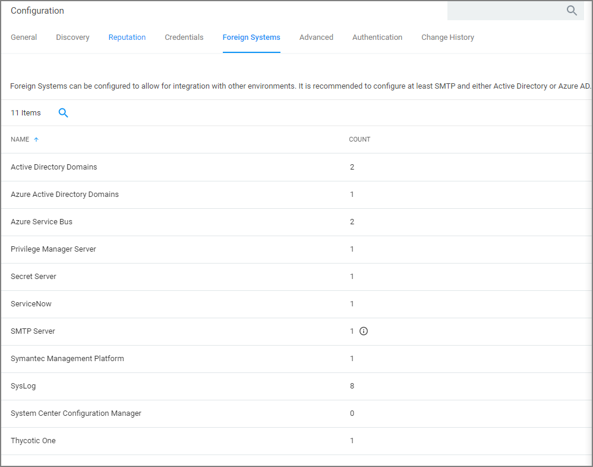

[title]: # (Foreign Systems Tab)
[tags]: # (admin,configuration)
[priority]: # (1)
# Foreign Systems

Foreign Systems in Privilege Manager are any systems for which a connections or an integration has to be set-up, providing a system URL (network address) and authentication information. Foreign Systems can be Thycotic or third-party products and their basic integration set-up in Privilege Manager is alike.

## Foreign Systems Tab

Foreign Systems can be configured to allow for integration with other environments. It is recommended to configure at least SMTP and either Active Directory or Azure AD.

In order to use Secret Server as the password vault please review [Setting up Integration between Privilege Manager and Secret Server](thycotic/set-up-pm-ss-integration.md)

## Integrations

### Thycotic Foreign Systems

* [Integration between Privilege Manager and Secret Server](thycotic/set-up-pm-ss-integration.md)
* [Integration between Privilege Manager and Privileged Behavior Analytics](thycotic/set-up-pba.md)
* [Thycotic One and Privilege Manager Cloud](thycotic/t1/index.md)

### AD Integration

* [Setting Up Azure Active Directory Integration in Privilege Manager](active-directory/set-up-privilege-manager-azure-ad-integration.md)

### Third-Party Foreign Systems Integration

* [Setting up an SMTP Server Connection](third-party/set-up-smtp.md)
* [Setting up a Cylance Connection](third-party/set-up-cylance.md)
* [Setting up a ServiceNow Ticketing Connection](third-party/set-up-servicenow.md)
* [ServiceNow Application](third-party/set-up-servicenow-app.md)
* [Setting up a ServiceNow Webhook Connection](third-party/set-up-servicenow-webhook.md)
* [Setting up VirusTotal](third-party/set-up-virustotal.md)
* [Setting up an SCCM Connection](third-party/set-up-sccm.md)
* [Setting up Syslog](third-party/set-up-syslog.md)
