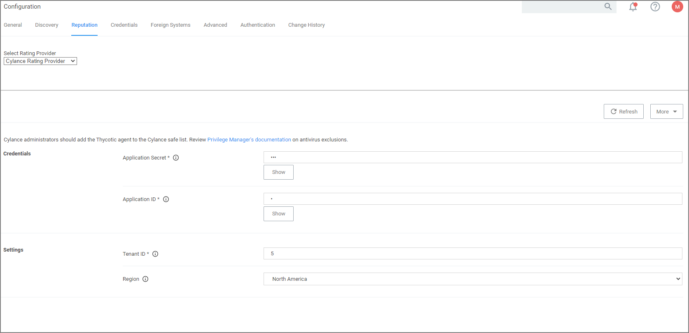
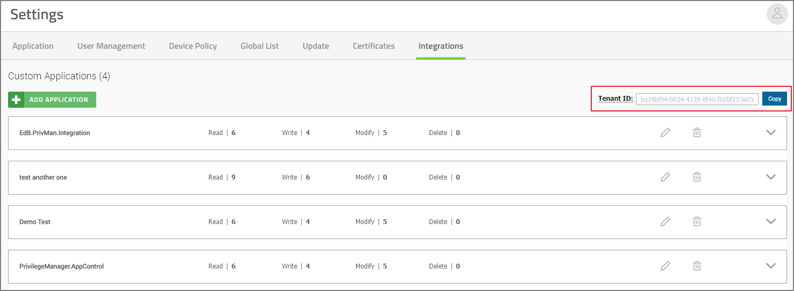
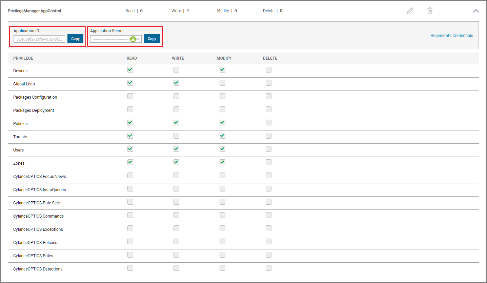
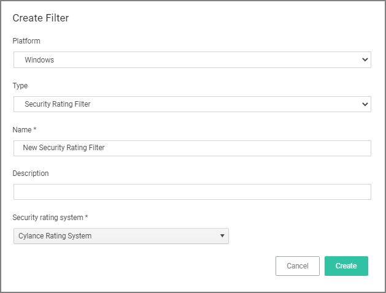
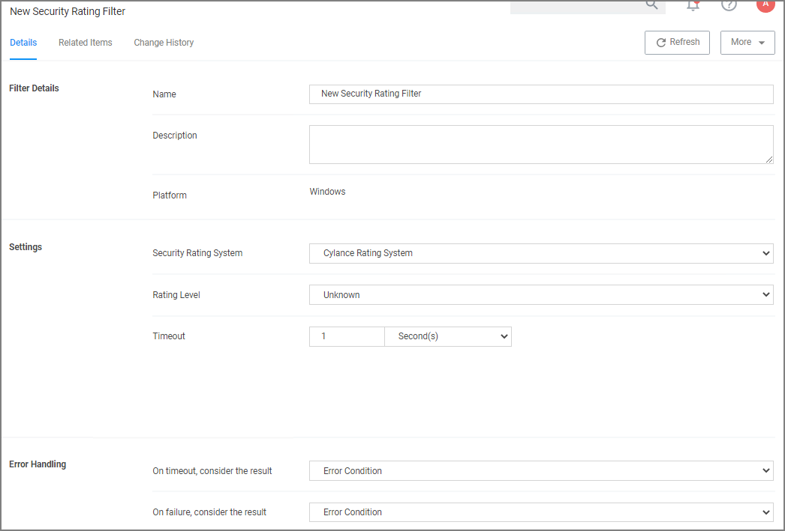

[title]: # (Cylance)
[tags]: # (integration)
[priority]: # (4)
# Setting up a Cylance Integration

Cylance is an Artificial Intelligence Based Advanced Threat Prevention Solution for enterprise environments. Privilege Manager (v10.5+) integrates with Cylance to help you proactively act on any unknown applications that run in your environment to prevent potential malware attacks. The steps below walk through how to setup a Cylance Integration in Privilege Manager and then create an example policy to begin using Cylance intelligence in action across your environment.

Keep in mind that while the Cylance integration provides insight into threat analysis, ultimately you can use Privilege Manager policies to act or react in whatever way makes most sense to your organization.

## Cylance Connector Installation Steps (On-prem only)

1. Open a browser on your Privilege Manager Web Server, browse to https://[YourInstanceName]/TMS/Setup/
1. On the Currently Installed Products screen, choose Install/Upgrade Products.
1. Select option Thycotic Cylance Reputation Connector.
1. Click on __Install__ and Accept the End User License Agreement. You will see your Installation Progress. Click on “Show install Logs” link to check for any errors

   > **Note**: If the installation of Cylance initially fails, redirect to https://[YourInstanceName]/TMS/Setup/ and click the Repair button next to the Cylance Product.

1. Once the Installation is successful, click on the __Home__ button.

## Configuring the Cylance Connector

1. Navigate to __Admin | Configuration__ and select the __Reputation__ tab.
1. From the Select Rating Provider drop-down, select __Cylance Rating Provider__.

   
1. Enter the required __Credentials__ and __Settings__ details. These details can be found in your Cylance account (login at protect.cylance.com). 
   1. In our Cylance account, navigate to __Settings__ and select __Integrations__. You find the __Tenant Id__ on the right side of the Custom Applications area.
      
   1. Select your Privilege Manager integration from the Custom Application list. You find the required __Application ID__  and __Application Secret__ on the left side of the page.
      
1. Once the Cylance details are entered in Privilege Manger, click __Save Changes__.

## Create a Cylance Security Rating Filter

1. Navigate to __Admin | Filters__.
1. Click __Create Filter__.
1. From the __Platform__ drop-down select either Windows or macOS.
1. From the __Filter Type__ drop-down select __Security Rating Filter__.
1. Name the policy and add a Description.
1. From the __Security Rating System__ drop-down, select __Cylance Rating System__.

   
1. Click __Create__.

   
1. Click __Create__.
1. Select the __Rating Level__ you wish to apply. You can also specify a __Timeout__ value and __Error Handling__ conditions on timeout and/or on failure, the options are:

   * Matched
   * Not Matched
1. Click __Save Changes__.

## Create a Cylance Policy

Use the Application Policies wizard to create a policy that uses the Cylance Security Rating filter created in the steps above.