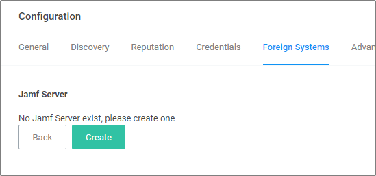
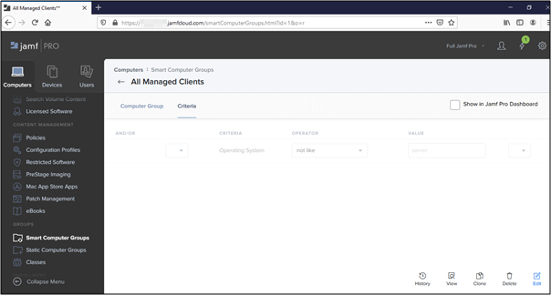

[title]: # (Jamf)
[tags]: # (integration)
[priority]: # (4)

# Setting up a Jamf Integration

Privilege Manger integrates with Jamf PRO to allow users to:

* Import Smart and Static Computer Groups:  
  * Computers
* Import installed applications on Jamf endpoints as discovered resources and create filters.
* Rollout Privilege Manager Agents on to Jamf Endpoints.

## Install the Jamf Connector

For on-premises Privilege Manager instances the Jamf Connector must be installed before it can be setup in the console.

## Create a Credential

Privilege Manager needs a username and password to access Jamf PRO. Create the credential in the Privilege Manager Console:

1. Navigate to __Admin | Configuration | Credentials__.
1. Click __Create__.
1. Enter the user credentials information for Jamf PRO server, click __Save Changes__.

## Connecting to Jamf Server

Before you can import data from Jamf PRO you need to setup a foreign systems connection in Privilege Manager for the Jamf integration.

1. Navigate to __Admin | Configuration | Foreign Systems__.
1. Select __Jamf server__. If this is not listed, make sure the connector is, refer to [Installing Foreign System Connectors](index.md).

   
1. Click __Create__.

   

   1. Enter the name of your __Jamf Server__. 
   1. Add your Jamf Server's credential. The Privilege Manager Default User Credential is populated by default and needs to be changed to the actual Jamf credential.
   1. Enter the URL of your Jamf Server.

   
1. Click __Create__. 

This is an example of the details page.

## Tasks

Below are the tasks created when the Jamf Server is installed.

1. Navigate to __Admin | Tasks__.
1. On the Tasks tab open the folder tree and select __Server Tasks | Foreign Systems | Jamf__.
   * Jamf Agent Rollout by Computers
   * Jamf Agent Rollout by Computer Groups
   * Synchronize Jamf Computer Applications by Computers
   * Synchronize Jamf Computer Applications by Computer Groups
   * Synchronize Jamf Computer Groups
   * Synchronize Jamf Computers with Thycotic Agents

## Synchronize Jamf Computer Groups

To import computer groups from the Jamf Server, the __Synchronize Jamf Computer Groups__ task must run. This task also imports related computer resources.

1. Navigate to __Admin | More__ and select __Tasks__.
1. On the Tasks tab open the folder tree and select __Server Tasks | Foreign Systems | Jamf__.
1. Click __Synchronize Jamf Computer Groups__.

   
1. Click __Run__.

   
1. Select your Jamf system via the __Select...__ option. Enter the Jamf server name to narrow the search, or leave empty to search all.

   
1. Under __Computer Group names__, type the names of the computer groups you want to import. These need to be exact name matches.
1. Click __Run Task__. The task executes and the task history is recorded.

Error codes are returned if the task fails due to loss of connectivity with Jamf, invalid credential or URL, and due to incorrect computer group names.

### Example Results

After running the __Synchronize Jamf Computer Groups__ task, you can view the results under Computer Groups.

1. In the Privilege Manager console from the left navigation, select  __Computer Groups__.
1. On the __Computer Groups__ page, change your view to __All__ to display all available computer groups.

   

### Compare Jamf Server with Import

You can compare, if the imported computer groups correctly reflect the data on your Jamf Server.

1. Login to Jamf PRO. 
1. Navigate to __Computers | Smart Computer Groups__ or __Static Computer Groups__

   

>**Note**: All the Computers Groups imported into Privilege Manager contain a static list of Computers. Though they are query based in Jamf PRO.
  
#### For Example
  
A Group named “All Managed Clients” is query based and gives the result of computers that are not a server.

When this group is imported into Privilege Manager, it shows the list of computers as a result of the above query.

The list gets updated in Privilege Manager only, when the __Synchronize Jamf Computer Groups__ task is manually run or based on a set schedule.

### Resources in Privilege Manager

Only the computers that are imported via the synchronization task are available as a Resource in Privilege Manager.

To look at the computer resources that were imported,

1. Navigate to __Admin | Resources__.
1. Select the Resources tab.
1. In the folder tree, open __Organizational Views | Default | All Resources | Assets | Network Resource | Computer__.

   

Select any of the synchronized Computer resources to view details on the basic inventory imported.

## Synchronize Jamf Applications By Computers

To import applications as filters, the __Synchronize Jamf Applications by Computers__ must run. The task does NOT import file inventory into Privilege Manager.

1. Navigate to __Admin | Tasks__.
1. Open the folder tree and select __Server Tasks | Foreign Systems | Jamf__.
1. Click __Synchronize Jamf Applications by Computers__.

   
1. Click __Run__.

   
1. Select your Jamf system via the __Select...__ option. Enter the Jamf server name to narrow the search, or leave empty to search all.

   
1. Click __Add Computers__, to add the computers from which to import applications.
1. Click __Run Task__. The task executes and the task history is recorded.

This imports all the applications as an __App Bundle Filter__ into Privilege Manager.

>**Note**: Make sure, you select specific Computers or the task imports applications from all computers.

## Synchronize Jamf Applications By Computer Groups

To import applications based on computer groups as filters, the __Synchronize Jamf Applications by Computer Groups__ must run. The task does NOT import file inventory into Privilege Manager.

1. Navigate to __Admin | Tasks__.
1. Open the folder tree and select __Server Tasks | Foreign Systems | Jamf__.
1. Click __Synchronize Jamf Applications by Computer Groups__.

   
1. Click __Run__.

   
1. Select your Jamf system via the __Select...__ option. Enter the Jamf server name to narrow the search, or leave empty to search all.

   
1. Under __Computer Group names__, type the names of the computer groups from which you want to import Applications. These need to be exact name matches.
1. Click __Run Task__. The task executes and the task history is recorded.

This imports all the applications as an __App Bundle Filter__ into Privilege Manager. This task will fail, if any computer group name is invalid.

### Sample Results of Application Sync

1. Navigate to __Admin | Filters__.

   The filters are named based of the application with its version.

   
1. Open any imported filters to see the details page.

   

The filters are created as a read-only filter. To customize the filters, use duplicate.

## Jamf Agent Rollout By Computers

Use the Jamf Agent Rollout By Computers task to rollout Privilege Manager Agents on endpoint that are
managed by Jamf.

### Prerequisites

In Jamf PRO, setup required Configuration Profiles:

* Allow Profile  
* PPPC Profile  

The profiles must be configured correctly considering the required KEXT and SYSEX  extensions.

The profiles must be rolled out before the user initiates any of the __Jamf Agent Rollout__ tasks for the corresponding Computers.

### Jamf Agent Rollout By Computers

Use the __Jamf Agent Rollout By Computers__ task to rollout agents by endpoint.

1. Navigate to __Admin |Tasks__.
1. Open the folder tree and select __Server Tasks | Foreign Systems | Jamf__.
1. Select __Jamf Agent Rollout By Computers__.

   
1. Click __Run__ and provide the required details:

   

   
1. Click __Run Task__.

The task executes and the task history is recorded.

This tasks creates the required details like __scripts__ and __policies__ on the Jamf PRO instance. These are then initiated using the __Check-in__ task in Jamf PRO to complete the installation of the Privilege Manager Agent. Once the agent is installed and registered, it communicates with the Privilege Manager server.

### Jamf Agent Rollout By Computer Groups

Use the __Jamf Agent Rollout By Computer Groups__ task to rollout agents by computer groups. The basic functionality of this task and the __Jamf Agent Rollout by Computers__ task is the same, just under a different scope, computers vs. computer groups.

1. Navigate to __Admin |Tasks__.
1. Open the folder tree and select __Server Tasks | Foreign Systems | Jamf__.
1. Select __Jamf Agent Rollout By Computer Groups__.

   
1. Click __Run__ and provide the required details:

   

   
1. Click __Run Task__.

The task executes and the task history is recorded. This task will fail, if any computer group name is invalid.

This tasks creates the required details like __scripts__ and __policies__ on the Jamf PRO instance. These are then initiated using the __Check-in__ task in Jamf PRO to complete the installation of the Privilege Manager Agent. Once the agent is installed and registered, it communicates with the Privilege Manager server.

## Synchronize Jamf Computers with Thycotic Agents

When a Privilege Manager Agent is rolled out on Jamf Endpoints, the agent rollout tasks create a duplicate computer resource with a different __itemId__. The __Synchronize Jamf Computers with Thycotic Agents__ task must be run to maintain unique computer resources in Privilege Manager. 

1. Navigate to __Admin | Tasks__.
1. On the Tasks tab open the folder tree and select __Server Tasks | Foreign Systems | Jamf__.
1. Click __Synchronize Jamf Computers with Thycotic Agents__.

   

Search for any computer which is imported from Jamf and has the Privilege Manager Agent installed. One computer resource is displayed.
