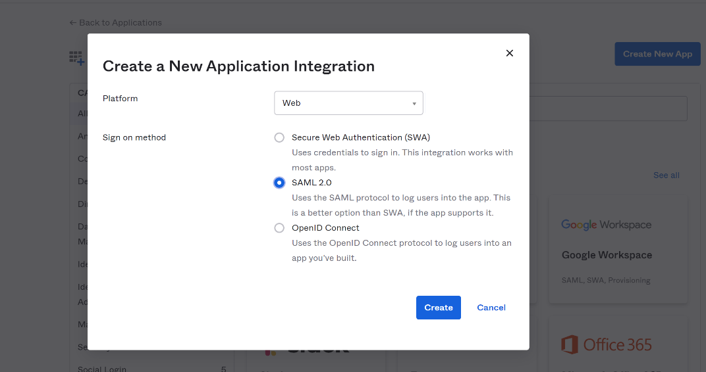
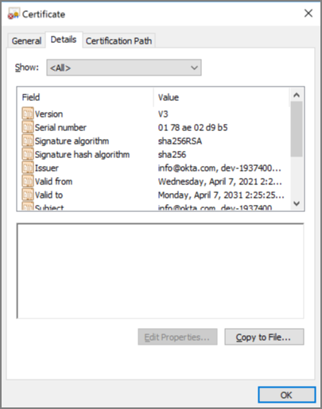
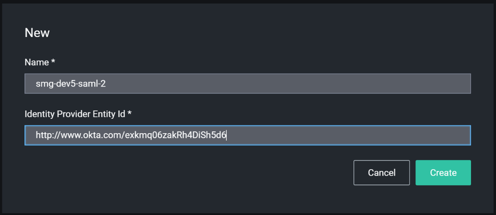
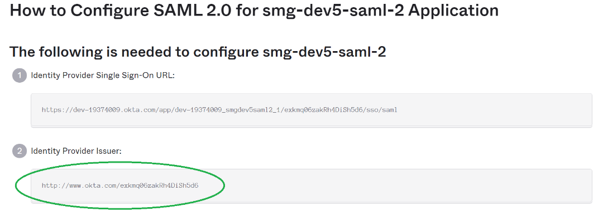
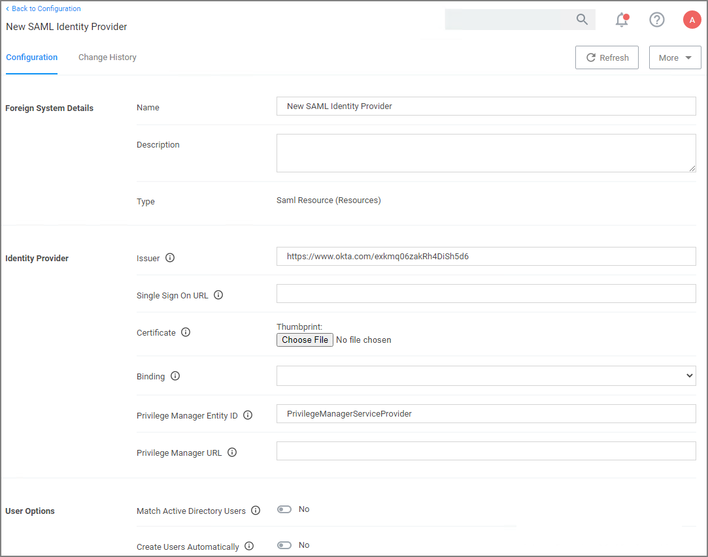
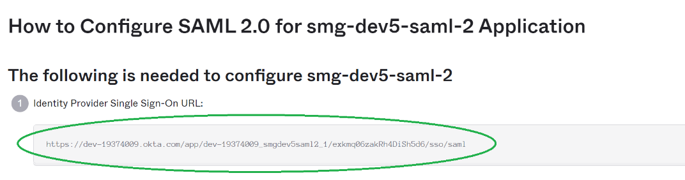
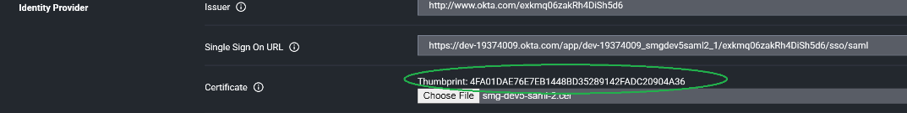

[title]: # (SAML)
[tags]: # (integration)
[priority]: # (4)

# Setting up a SAML Integration

All SAML Foreign Systems integrations follow the same principle steps:

1. Set up the identity provider.
1. Use data from the identity provider setup for setting up the Privilege Manager Foreign Systems.

For the purpose of this procedure we use Okta as the identity provider example.

## Create a new Application

An application is a definition for integration with an external application (in this case, Privilege Manager).

In Okta, create a new application. Don’t select one of the existing: 

1. In the top right of the app page, click __Create New App__.
1. From the __Platform__ drop-down, select __Web__.
1. From the __Sign on method__ options, select __SAML 2.0__.

   
1. In the __App name__ field provide an Application Name. Depending on your use case, provide an application logo and select App visibility settings.
1. Click __Next__>

### Enter Application SAML Settings

On the next pages, you’ll configure the SAML settings. 

1. Enter the __Single sign on URL__. The __Single sign on URL__ is the root Privilege Manager URL plus __saml2/acs__. For most systems this is `https://servername/Tms/saml2/acs`.
1. Enter the __Audience URI__, which can be anything as long as it matches what you put in
Privilege Manager. The default value in Privilege Manager is `PrivilegeManagerServiceProvider`.
1. The __Default RelayState__ can be left blank.
1. The __Name ID format__ drop-down set to __Unspecified__.
1. From the __Application username__ drop-down, select __Okta username__. 

   The rest of the settings can be ignored.
1. Proceed via __Next__.
1. On the last page for the __Are you a customer or partner?__ prompt, select __I'm an Okta customer adding an internal app__.you will be ask about the app, I usually just say it’s an
internal app. 
1. Click __Finish__.

### View Setup Instructions

After the app is created, you’ll want to click __View Setup Instructions__ and leave the instructions open in the browser. You’ll want to copy and paste some of this info into
Privilege Manager in the next section.

### Save Certificate

Start with the certificate data.

1. Click __Download certificate__ and save the certificate as __.cer__. Okta will try to save it as .cert.
1. Once it’s save you should be able to open and view the certificate in Windows:

## Privilege Manager Foreign Systems Setup

### Create SAML Identity Provider

1. Navigate to __Admin | Configuration__ and select __Foreign Systems__.
1. Click __SAML Identity Providers__.
1. Click __Create__. 

   
1. Enter a name for the Foreign System. 
1. For __Identity Provider Entity Id__, enter the issuer name from the setup instructions. For example:

   
1. Click __Create__.

   
1. Under __Identity Provider | Single Sign On URL__ enter the URL from the setup instructions.

   
1. Under __Certificate__, select the certificate you saved earlier.
1. From the __Binding__ drop-down, select __HTTP Post__.
1. Under __Privilege Manager Entity ID__ match what you entered in the app setup for Audience URI (SP Entity ID), for example _PrivilegeManagerServiceProvider_, if you went with the default suggestion.
1. Under __Privilege Manager URL__, enter your instance URL, for example `https://myprivilegemanger/Tms/`.
1. Click __Save Changes__.

>**Note**: After saving the identity provider, Privilege Manager shows the certificate thumbprint in the UI. It should match what Windows shows for the thumbprint on the certificate downloaded from Okta:
>
>

### Configure User Options

Normally you need to create a new [Federated user](../../../users/index.md) that matches an Okta username.
But you can optionally have Privilege Manager match AD users by `DOMAIN\username` and/or create new Federated users automatically.

#### Match Active Directory Users

If you select this option, you must configure Okta to send users in the format `DOMAIN\username` or `username@domaindnsname`. You should import users (and groups if desired) from AD, and add the desired user(s) to one or more Privilege Manager Roles before attempting to sign in.

#### Create Users Automatically

When this option is selected, Privilege Manager will create a new Federated user whenever a username cannot be matched to an existing Federated user (or AD User if the option above is selected).

>**Note**: You’ll still need to [add the user to a Privilege Manager role](../../../users/index.md#add_roles_to_a_user) before they’ll have any meaningful access. Support for group/role assertions is planned for a future release.

## Managing Users

### Create New Okta Users

If you don’t have any Okta users, you’ll need to go to the Okta Directory section and add them.

Okta requires the usernames be in the format of an email address. These are the usernames your users are going to user when they log into Privilege Manager. You can configure Okta to send Privilege Manager a different username (like `domain\username`, or a short name like `yoda`).

### Add Okta Users to Application

Before you can login, users must be assigned to the application in Okta.

1. Go to __Applications | Applications__.
1. Select your application.
1. Select __Assignments__.
1. Click assign and select one or more users.

>**Note**: After assigning a user, you can change the username to be whatever you want. Click the edit (pencil), and enter the username for your user (this only changes the username for this specific application).

### Setup Active Directory Users

You can use Active Directory users that you’ve already imported into Privilege Manager.

**NOTE:** After you’ve imported from Active Directory, you still need to add the AD users (or AD groups) to Privilege Manager roles.

#### Match by DOMAIN\username

Ensure the username in Okta matches the Global Identity data for the user in Privilege Manager:

#### Match by username@dnsdomainname

Ensure the username in Okta matches the Global Identity UserId in Privilege Manager, and the domain name part of the username matches the DNS domain name of the domain in Privilege Manager. We don’t import this directly from AD, so we have to get it from the Global Identity and AD foreign system data.

>**Note**: Refer to the [Authentication Tab](../../authentication/index.md) topic for details on managing authentication providers.
