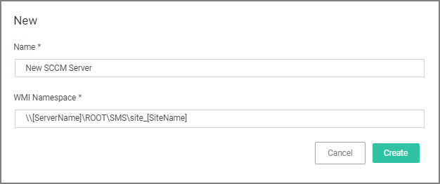
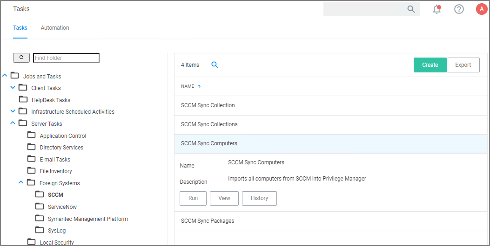
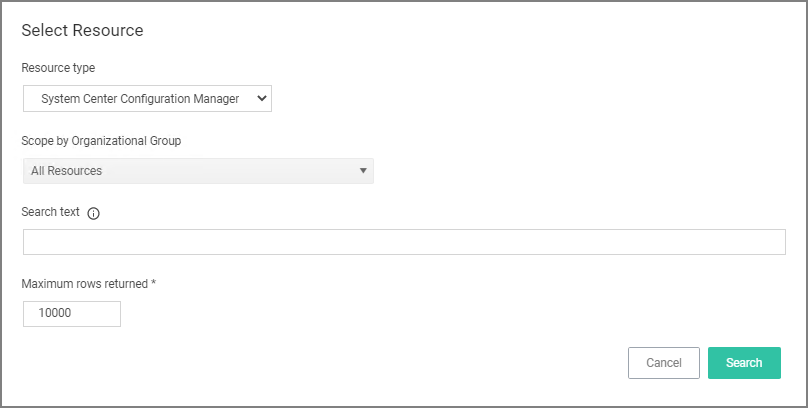
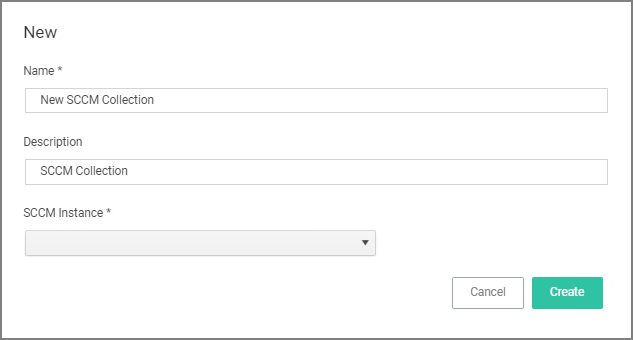
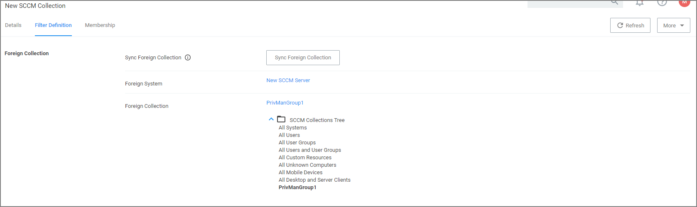
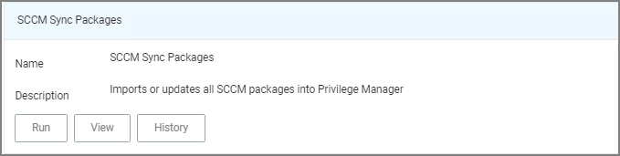
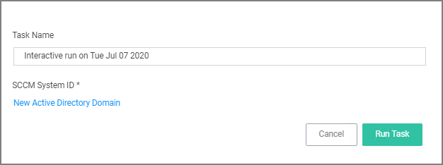
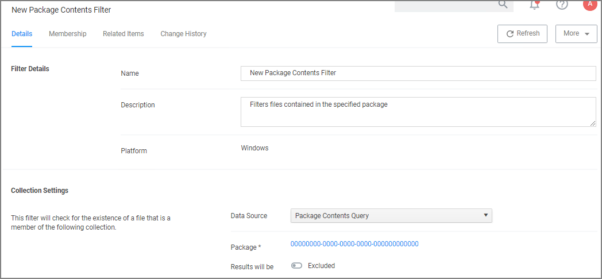
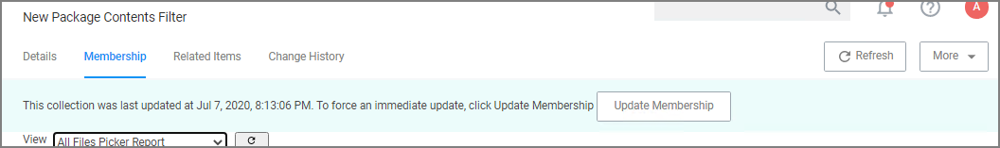

[title]: # (SCCM)
[tags]: # (integration)
[priority]: # (4)
# Set-up Microsoft System Center Configuration Manager (SCCM) Integration

Privilege Manger integrates with Microsoft System Center Configuration Manager (SCCM) to allow the

* [import of computers](#import-computers) for use in computer groups and identifying systems that exist on the network, but don’t have an endpoint agent installed yet.
* [import of existing Device Collections](#create-a-collection) from SCCM and use them for Privilege Manager computer groups.
* [inventory of SCCM Software Packages](#inventory-software-packages) to use the package contents in Privilege Manager Application Control policies.

## Create a Credential

Privilege Manager needs a username and password to access SCCM.  If you have not already created an appropriate user credential:

1. Navigate to __Admin | Configuration | Credentials__.
1. Click __Create__, to create user credentials to access SCCM.
1. After entering the user credentials information for SCCM, click __Save Changes__.

## Connecting to SCCM

Before you can import data from SCCM you need to setup a foreign systems connection in Privilege Manager for the SCCM integration.

1. Navigate to __Admin | Configuration__ and select the __Foreign Systems__ tab.
1. Select __System Center Configuration Manager__. If this is not listed, make sure the connector is installed by verifying via the __Privilege Manager Add/Upgrade Features__ page.
1. Click __Create__.

   
1. Enter the name of the SCCM Server and provide the __WMI Namespace of the SCCM Site__.
1. Click __Create__.
1. Under Settings from the __Credential__ drop-down, select the SCCM account created in the previous procedure.
1. Click __Save Changes__.

## Import Computers

Before you can import collection data from SCCM, Privilege Manager needs to know about computers in your SCCM.

1. Navigate to __Admin | More__ and select __Tasks__.
1. On the Tasks tab open the folder tree and select __Server Tasks | Foreign Systems | SCCM__.
1. Click __SCCM Sync Computers__.  

   
1. Click __Run__.
1. Select your SCCM system via the __Select...__ option.

   
   1. Under Scope by Organizational Group type the name of your sccm system in the search text or use the search option.
1. Click __Run Task__.

### Verify the Computers have been Imported (optional)

1. Navigate to __Admin | Resources__.
1. Open the __Resources__ tab.
1. In the folder tree open __Organizational Views | Default | All Resources | Asset | Network Resource | Computer__.
1. Select a computer from that list.
1. Select the Known Data tab in the computer resource explorer view.
1. In the tree under __Foreign Systems__, you should have the Foreign System Id and SCCM Platform Id data.

## Create a Collection

After computers have been imported, you can create a collection to mirror an SCCM collection.

1. Navigate to __Admin | Resources__, open the __Resource Filters__ tab.
1. In the folder tree under __Resource Filters__ open __Collections | System Center Configuration Manager__.
1. Click __Create__
1. Enter a Name and Description, and specify the SCCM instance to connect to.

   
1. Click __Create__.
1. Select the Filter Definition tab and under __Foreign Collection__ select the Collection target.

   
1. Click __Save Changes__.
1. Click the __Sync Foreign Collection__ to update the membership immediately. The foreign collection update can also be scheduled by following the link in the help tip.
1. Select the Membership tab and then click the __Update Membership__ tab to see the current membership of this collection.

## Inventory Software Packages

Once the Foreign System has been created, an on-demand packages synchronization can be run and/or a regular synchronization schedule can be set-up via the following steps:

1. Navigate to __Admin | More__ and select __Tasks__.
1. On the Tasks tab open the folder tree and select __Server Tasks | Foreign Systems | SCCM__.
1. Click __SCCM Sync Packages__.  

   
1. Click __Run__.
1. Select your SCCM system via the __Select...__ option.
   1. Under Scope by Organizational Group type the name of your sccm system in the search text or use the search option.

   
1. Click __Run Task__.

Alternatively the __SCCM Sync Packages__ task can be scheduled to regularly repeat. When viewing the task, navigate to the Schedules tab and create a new schedule.

### Create a SCCM Package Content Filter

After the Package Synchronization completes the SCCM Packages can be used in application control policies via package content filters.

1. Navigate to __Admin | Filters__.
1. Click __Create Filter__.
1. From the Platform drop-down select Windows.
1. From the Filter Type drop-down scroll to Inventory Filters and select the __Package Contents Filter__.
1. Set the Name and Description of the filter.
1. Click __Create__.
1. Under __Collection Settings__
   1. from the __Data Source__ drop-down select a resource.
   1. Click the package link to specify the SCCM that will be targeted.
   1. Set the switch __Results will be__ to __Included__.

    
1. Navigate to the __Membership__ tab.
1. If no items are listed in the membership table, click __Update Membership__.

    

    Running the sync package task, causes the server to inventory the package referenced in the filter. If you have multiple filters and packages, Thycotic recommends to use the _Inventory Packages Referenced in Allowlists_ task instead.
1. Click __Save Changes__.

This filter can then be referenced in Application Control policies.
