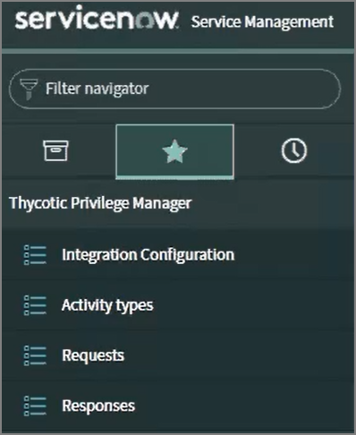
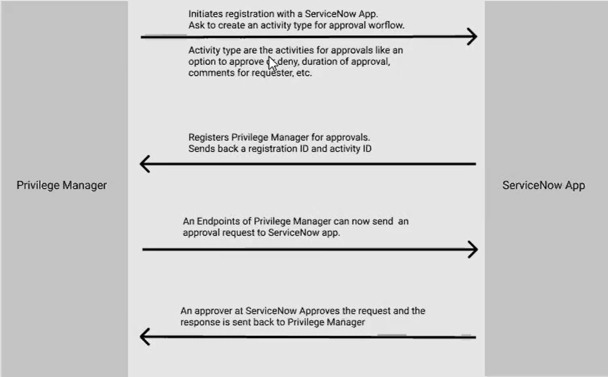
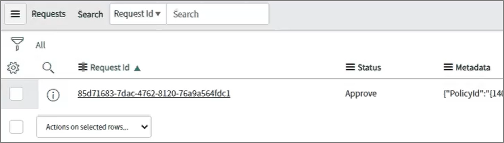
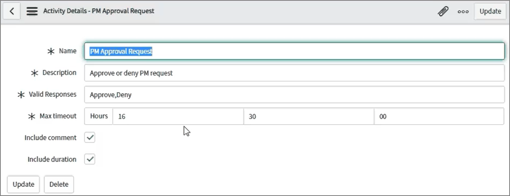

[title]: # (ServiceNow Application)
[tags]: # (integration)
[priority]: # (4)

# ServiceNow Application

With Privilege Manager v11.1, a Thycotic Privilege Manager ServiceNow application is available in the ServiceNow app store allowing approval workflow management.

## Prerequisites

In ServiceNow:

* A ServiceNow instance and general knowledge, familiarity with the ServiceNow product.
* Three role credentials:
  * a ServiceNow Instance administrator user.
  * an application administrator user.
  * an application approver user.

In the Privilege Manager console:

* An API Client User to use with the ServiceNow webhook configuration.
* A Foreign Systems configuration for the ServiceNow webhook configuration. Refer to [ServiceNow Webhook Setup](set-up-servicenow-webhook.md).

## Approval Workflow between Privilege Manager and the ServiceNow Application

This Foreign Systems setup requires an active Webhook configuration.

## Request/Responses

All requests received are listed under the Request menu.

Users verify the status and status code by clicking on individual requests received.

## Activity Setup

Activity Details can be configured with various process parameters, like max timeout values:

