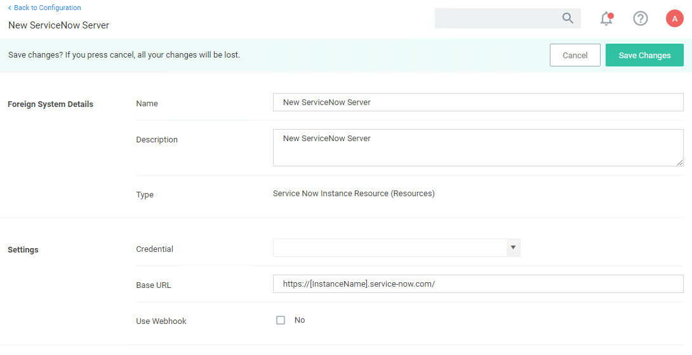
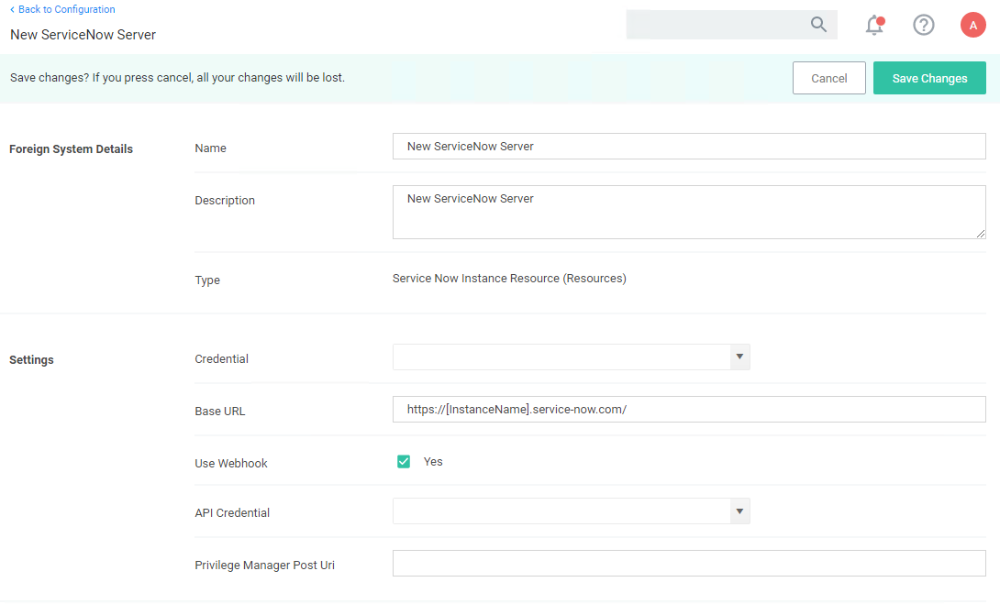
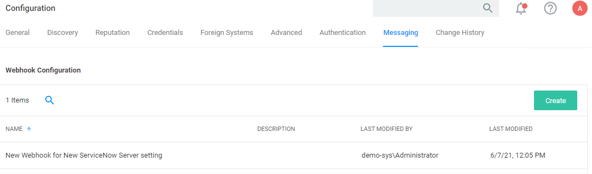
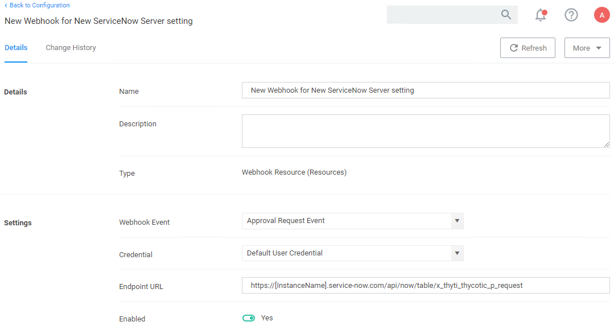
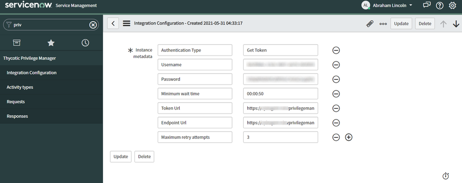

[title]: # (ServiceNow Webhook)
[tags]: # (integration)
[priority]: # (4)
# Setting up a ServiceNow Webhook Connection

One you have your foreign system established in the Privilege Manager Console, you are ready to also enable Webhook configuration.

## Configuration an API Credential

1. Navigate to __Admin | Configuration | Credentials__.
1. Click __Create__ and create a webhook __API Credential__ as a standard user.
   1. Create an __API Client User__. Refer to [How to Manually Add API Client Users](../../users/index.md#how_to_manually_add_api_client_users) and [Add Roles to Users](../../users/index.md#add_roles_to_a_user). Copy the __Client Id__ and __Secret__ for the credential.
1. For __Account Name__ enter the __Client Id__.
1. For __Password__ enter the __Secret__.
1. Click __Save Changes__.

## Configuring the Webhook

1. Navigate to your ServiceNow Foreign Systems configuration (__Admin | Configuration | Foreign Systems__ and select the the ServiceNow foreign system from the list).

   
1. Select __Use Webhook__.

   
1. From the __Credential__ drop-down, select the webhook credential you created above.
1. For __Privilege Manager Post Uri__ save the API Endpoint, usually something like `https://yourprivilegemanagerinstance.com/Tms/services/api/v1/approval/approve`
1. Click __Save Changes__.

Once the foreign system is saved, a new webhook is created in the background and a server task is triggered to register the webhook with the ServiceNow App.

## Verifying the Webhook Creation

1. Navigate to __Admin | Configuration__.
1. Select the __Messaging__ tab.
1. Under __Webhook Configuration__, verify your webhook is listed.

   
1. From the list of configured webhooks, click on the one you just created.

   

The default webhook event for ServiceNow foreign systems integrations is __Approval Request Event__.

### Registration with ServiceNow App

The process takes place automatically when the ServiceNow instance is saved with the __Use Webhook__ checkbox ticked. The registration returns an Instance Id (returned as __sys id__ on a POST) that must be sent with each request.

The registration request body is visible in the ServiceNow instance on the Integration Configuration tab.

   

The supported __Activity Type__ must be registered before a request of a specific request type can be sent. Activity registration will return ActivityType Id(returned as __sys id__ on a POST).

The Activity type supports two valid responses:
* Approve
* Deny
