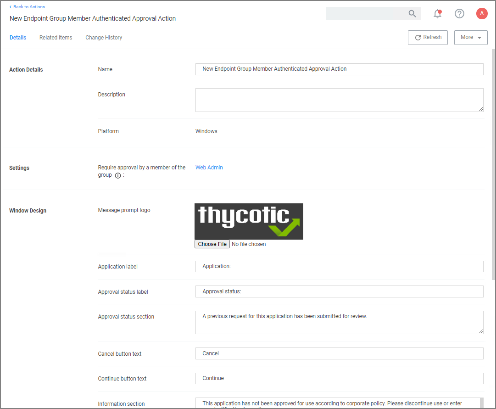

[title]: # (ServiceNow)
[tags]: # (integration)
[priority]: # (4)
# Setting up a ServiceNow Integration

## Foreign System Configuration

Here are the steps to integrate Workflow between your ServiceNow Ticketing System and Privilege Manager.

1. Verify which ServiceNow User account you will use for your integration with Privilege Manager. If you decide to create a new user account to manage your approval requests, make sure that it includes the required roles for your environment:
   * Web Service Admin (`web_service_admin`) and
   * Approval Admin (`approval_admin`).
   * For ServiceNow MID Server environments, the `mid_server` role permission also needs to be added to the account.
   * The task __Create ServiceNow Request Items__ requires temporary __admin__ credentials for the ServiceNow instance. Once those items are created, the user does not need admin access anymore.

   Refer to [ServiceNow product documentation, specifically Base System Roles](https://docs.servicenow.com/bundle/geneva-servicenow-platform/page/administer/roles/reference/r_BaseSystemRoles.html).
1. Verify that the ServiceNow connector is installed for your Privilege Manager Cloud instance:
   1. In the Privilege Manager console navigate to __Admin | Configuration__ and select the __Foreign Systems__ tab.
   1. If the connector is installed, __ServiceNow__ is listed under Foreign System.

      
1. Select the __Credentials__ tab.
1. Click __Create__.
1. Under Details, enter a Name and Description for your ServiceNow credentials.
1. Under Settings, enter the information from your ServiceNow User account that was referenced in step 1 above, click __Save Changes__.
1. Select the __Foreign Systems__ tab.
1. Select the __ServiceNow__ link from the list of foreign systems displayed.
1. Click __Create__.
1. Enter a Name for your ServiceNow Server.
1. Enter the Base URL from your ServiceNow instance `https://[InstanceName].service-now.com/`.
1. Click __Create__.
1. Assign the credentials you created previously to link to your instance.

   

## Define Policy and Actions

You need to create an action and attach it to a policy to manage what events you want sent to ServiceNow for approvals.

1. In the Privilege Manager console, navigate to __Admin | Tasks__.
1. Click the __Automation__ tab.
1. In the tree, navigate to __Automation | Approvals | Approval Processes__, click __Create__.

   
1. Enter a name and description, click __Create__.

   
1. Under __Settings__ specify your ServiceNow Server, click __Save Changes__.
1. Back in the Automation tree, select __Approval Types__, click __Default Execute Application Request Type__.

   

   Duplicate and customize the Automation Task.
1. Select your __ServiceNow Approval Process__.

   
1. Click __Save Changes__.

### Run the Create ServiceNow Approval Request Items Tasks

1. Next, in __Search__ at the top of your Privilege Manager console, search for _Create ServiceNow Approval Request Items_.
1. In your search results, __click on this task__ and then select from the __More__ drop-down __Run Task__.

   
1. Under ServiceNow System ID, click __Select...__ and select the resource and add the ServiceNow Server that you created as a Foreign System earlier.
   1. From the Scope by Organizational Group drop-down, select your resource.
   1. Enter a Search text.
   1. Click __Search__.
   1. Select from the list of returned results.
   1. Click __Select__.
1. Click __Run Task__.

   >**Note**:
   >Clients with robust ServiceNow installations are welcome (and in fact encouraged) to alter their ServiceNow scripted web services for use with their own ServiceNow items and workflow rather than relying on this importing task.

   The task you just ran creates several new items in your ServiceNow dashboard.

## ServiceNow Steps

Open ServiceNow and navigate to __Scripted Web Services | Scripted SOAP Services__ to verify that these three new options are listed:

* CancelExecuteAppApprovalRequest,
* CreateExecuteAppApprovalRequest,
* GetExecuteAppApprovalRequestStatus  

  

Now you've successfully defined a SOAP endpoint that Privilege Manager knows how to call to initiate a ServiceNow request for approval.

## Defining Actions in the Privilege Manager Console
### Using an Approval Request (with ServiceNow Request ItemNumber) Form Action

1. Navigate to __Admin | Actions__.
1. Search and select __Approval Request (with ServiceNow Request ItemNumber) Form Action__.

    Form Action")
1. Click __Duplicate__.
1. Name your new action and click __Create__.
1. Customize the Action based on your specific business requirements.
1. Click __Save Changes__.
1. Navigate to your computer group's __Application Policies__, click __Create Policy__ or find an existing policy that you want to use for ServiceNow Approvals.
1. Under the __Actions__ section, search for and add the action you previously created, _ServiceNow Approval Request Form Action_.
1. Click __Save Changes__.
1. Click the __i__ next to __Deployment__ and select __Resource and Collection Targeting Update__ to immediately send the policy to your endpoint agents.

Policies also automatically update according to a schedule.

### Using an Endpoint Group Member Authenticated Message Action

This action can be used for _over the shoulder_ approvals whether systems are on- or offline. The supervisor approves access by authentication on the user's endpoint system.

1. Navigate to __Admin | Actions__.
1. Click __Create__.
   1. On the __Create Action__ modal from the __Platform__ drop-down select __Windows__.
   1. From __Type__ drop-down select __Endpoint Group Member Authenticated Approval Action__.
   1. Enter a meaningful __Name__ and __Description__.
   1. From the __Approval Group__ drop-down, select the group membership of the approver.

      
   1. Click __Create__.

   
1. Under Settings verify the __Require approval by a member of the group:__ contains the correct group. If you ever need to change it, come back to this page and click the group name to access the change modal.
1. Navigate to your computer group's __Application Policies__, click __Create Policy__ or find an existing policy that you want to use for ServiceNow Approvals.
1. Under the __Actions__ section, search for and add the action you previously created.
1. Click __Save Changes__.
1. Click the __i__ next to __Deployment__ and select __Resource and Collection Targeting Update__ to immediately send the policy to your endpoint agents.

Policies also automatically update according to a schedule.

Sample Group Member approval notice with approval overlay:

Refer to the __Endpoint Group Member Authenticated Approvals__ report In Privilege Manager or your ServiceNow instance to view a history of "over the shoulder" approvals:

## Integration Workflow

Now that you have a policy attached to your ServiceNow integrated Action, the requests from your policy will be sent through ServiceNow for approval.

1. On your endpoint, perform the action that your policy targets for ServiceNow Approval. You will be prompted with a justification window to explain your request. To approve these requests, open your ServiceNow Dashboard.
1. Go to __My Requests__ in ServiceNow and you will see your new requests.
1. Click Requested for details.
1. In the Request page you will be able to view details of what action is being requested, and you can Accept the action.
1. On your endpoint, the pending justification window will update to an Approved status, and the user will be able to access their requested application.

## Create Approval Request Items Task

Privilege Manager integrates with ServiceNow to manage approvals for user-requested application execution and elevation.  For this integration to work there are several items that must be created in your ServiceNow instance.  You can create these items manually or run the Create ServiceNow Approval Request Items task in Privilege Manager to create them automatically.

Most of the items created automatically by the Create ServiceNow Approval Request Items task are generic, and you are encouraged to replace these items with their own, and use your own workflows, forms, etc.  This document describes what default items this task creates, and what is required for the integration to work so that you can adjust according to your own ServiceNow system.

## How to create ServiceNow Approval Request Items Task

When you run the Create ServiceNow Approval Request Items task, Privilege Manager creates the necessary items in ServiceNow so that it can use ServiceNow to manage requests to approve execution or elevation of applications.  This section describes each item and their functions:

__Thycotic__:

The task creates a service catalog category named “Thycotic” within your ServiceNow UI.

__Execute Application Request__:

The task creates a service catalog item named “Execute Application Request” and associates it with the Thycotic service catalog category.

## Variables

| Variables | Description  |
| ----- | ----- |
| PMApprovalId | The Privilege Manager internal identifier for the approval request |
| PMInitiatorId | The Privilege Manager internal identifier for the user that initiated the request |
| PMInitiatorName | The name of the user that initiated the request |
| PMPolicyId | The Privilege Manager internal identifier for the policy associated with the approval request |
| PMPolicyName | The name of the policy associated with the approval request |
| PMAgentId | The Privilege Manager internal identifier for the endpoint on which the request was initiated |
| PMAgentName | The name of the endpoint on which the request was initiated |
| PMProcessId | The Privilege Manager internal identifier for the process configuration item associated with the approval request |
| PMProcessName | The name of the process configuration item associated with the approval request |
| PMFilePath | The path to the application the user is attempting to run |
| PMUserReason | The reason given by the user requesting the approval |

### CreateExecuteAppApprovalRequest

The task creates a scripted SOAP service named “CreateExecuteAppApprovalRequest.” When a user initiates an approval request, Privilege Manager will call this service with input data about the request.  The default script will create a new Execute Application Request service catalog item, fill out the variable data from the inputs, and submit the item. The service returns the ID of the item to Privilege Manager so that it can periodically check or update the status of the item.

### Script Input

The task creates inputs with the same names as the Variables in Execute Application Request listed above

### Script Output

The task creates an output named “PMRequestId.”  Privilege Manager looks for this output by name and records it so can be used in future service calls to check or update the request status.

### GetExecuteAppApprovalRequestStatus

The task creates scripted SOAP service named “GetExecuteAppApprovalRequestStatus.”  When an approval is in progress, Privilege Manager will periodically call this service to determine if the request has been approved or rejected.

### Script Input

The task creates an input named “PMGetRequestId.”  Privilege Manager supplies this input using the value from PMRequestId that was output from the CreateExecuteAppApprovalRequest service.

### Script Output

| Script Output | Description |
| ----- | ----- |
| PMApprovalStatus | Privilege Manager expects this service to return PMApprovalStatus with one of the following values:|
|   | approved: The request has been approved |
|   | rejected: The request has been rejected |
|   | pending: The request is still pending approval or rejection |
|   | invalid: PMGetRequestId is not a valid ID, or the approval request is in an otherwise invalid state and will be rejected by Privilege Manager.
| PMComment | If there is a comment by the worker that approved or rejected the request, it can optionally be returned in the output named PMComment.  If this output is present Privilege Manager will record it with the status of the request in its database |

### CancelExecuteAppApprovalRequest

The task creates a scripted SOAP service named “CancelExecuteAppApprovalRequest.” If a request times out from within Privilege Manager, Privilege Manager will call this service to cancel the corresponding item in ServiceNow.

>**NOTE**: Privilege Manager expects this service to be defined in ServiceNow, but the product does not invoke this except when a request times out from Privilege Manager.

### Inputs

| Inputs | |
| ----- | ----- |
| PMCancelRequestId |  Privilege Manager call this service with PMCancelRequestId set to the value from PMRequestId returned from the CreateExecuteAppApprovalRequest service. |
| PMCancelComment | Privilege Manager calls this service with PMCancelComment set to a comment about why the request is being canceled. |

### Outputs

The task creates the output named __TmsCancelResult__.  Privilege Manager expects an output with this name, but currently ignores the value.

## Required Integration Points

### What Can Change vs. What Must Remain

Most of the ServiceNow back end can be changed to accommodate your own items and workflows.  Privilege Manager only requires the three scripted SOAP web services described above.  You are welcome to change the script within the services to do whatever is necessary for your environment.  

While the inputs that Privilege Manager sends to the services are fixed, once they reach ServiceNow you are free to do (or not do) what you want with the values.

Privilege Manager expects the outputs from the services as described above.  PMRequestId is by default the ServiceNow sys_id of the requested service catalog item instance, but can be any string up to 256 characters used to identify the request.  It’s up to you to ensure that the status and cancel services can interpret that value.

You can change the names of the services if you update the names in the ServiceNow Approval Process configuration in Privilege Manager.  You can also create multiple ServiceNow Approval Process items within Privilege Manager, and each can reference their own set of services.
