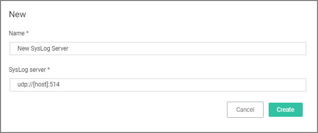
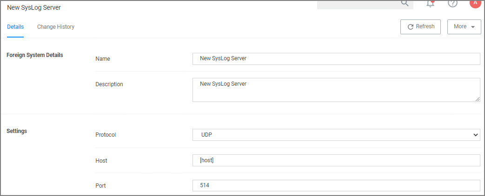
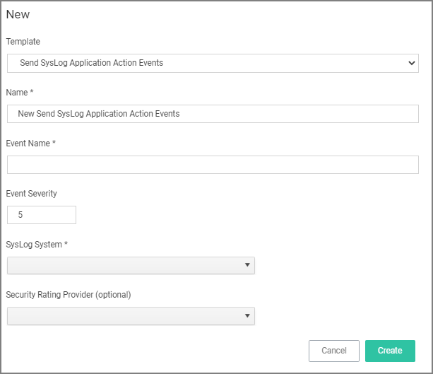
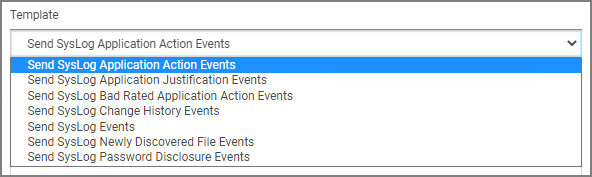

[title]: # (SysLog)
[tags]: # (integration)
[priority]: # (4)
# Setting up a SysLog Connection

Privilege Manager can push out SysLog formatted messages on a set schedule. Note that this does not happen immediately upon events occurring. Listed below are steps for configuration and task creation for scheduling the action of sending Discovery Event logs to a SysLog server.

>**Note**: The Send policy feedback option needs to be enabled on all policies that are supposed to send SysLog formatted events.

## Configuring SysLog Connection

To configure SysLog messages in Privilege Manager:

1. Navigate to __Admin | Configuration__ and select the Foreign Systems tab.
1. Click on SysLog and __Create__. Set a Name and the SysLog Server Address (either tcp or udp). The default is udp on port 514.

   

1. Once the server is created, you can use __Edit__ to change any of the configuration settings.

   

   The protocol drop-down options are UDP, TCP, and HTTPS. HTTPS supports integrations with DEVO.

## Setting up SysLog Server Tasks

1. After adding a new Syslog connection, to manually send logs to your Syslog Server go to __Admin | Tasks__.
1. Expand the __Server Tasks__ folder, then __Foreign Systems__, select SysLog and click __Create__.
1. From the __Template__ drop-down, for example select __Send SysLog Application Events__.
1. Add a Name for this task, an Event Name (e.g. “Privilege Manager Application Events”), and Event Severity.
1. From the _SysLog System_ drop-down select your SysLog server foreign system (configured above).
1. Optionally also enter a __Security Ratings Provider__, depending on your other integrations.

   
1. Click __Create__.

Once created, you’ll be taken to the new Scheduled Task's page where you can run the task on demand and/or specify how often you want events received by Privilege Manager (i.e. all events viewed in Admin | Event Discovery) to be pushed out to the SysLog server. The schedule can be hourly, every 30 minutes, daily, or whatever time period is preferred.

After this task runs and successfully completes, verify that Event Discovery events appear in your SysLog system.

### Template Options

The following template options are available:

* __Send SysLog Application Action Events__ - Use this template to send application action events to your SysLog system. Application Action Events contain generic information about the application that run, which policy was triggered, the date/time stamp, computer, and user for example.
* __Send SysLog Application Justification Events__ - Use this template to send application justification events to your SysLog system. For example, if a user runs an application requiring a justification workflow.
* __Send SysLog Bad Rated Application Action Events__ - Use this template to send an event to your SysLog system, when an application is being installed or executed, that is identified with a bad security rating.
* __Send SysLog Events__ - Use this template to send all SysLog events to your SysLog system. These events are based on the different options you selected on the SysLog server during setup.
* __Send SysLog Newly Discovered File Events__ - Use this template to send newly discovered file events to your SysLog system. For this to produce any events the Default File Inventory Policy needs to be enabled and resource discovery schedules need to be customized.
* __Send SysLog Password Disclosure Events__ - Use this template to send all password disclosure events to your SysLog system.

### Data Sources

The following five data sources can be used with the respective templates above:

* __Application Control Justification Events__ (7d6bdbf0-8f2a-4e9c-9c7e-fa6b75803c45)
* __Application Control Policy Feedback__ (eeb7aaf6-f675-4586-a7e3-3eb54b59ba4d)
* __Recently Discovered Applications Query__ (b875d3a6-433c-42cc-8332-05350343e498)
* __Local Security Password Disclosure Events__ (13d6cf4d-0132-4401-88ab-80b55301c60c)
* __Application Control Policy Feedback Restricted to Security Level__ (4eb4ec69-d7a9-4797-972a-41855d3e7799)

If custom data sources are used, they need to specify the following fields:

* externalId
* Facility
* Severity
* EventTime
* Host
* DeviceVendor
* DeviceProduct
* DeviceVersion
* Name
* CEFSeverity

## Troubleshooting if SysLog Option is Missing under Foreign Systems

If you are a Privilege Manager Cloud customer, contact Thycotic support to have it added to your instance.

On-premises customers, navigate to https://[YourOrganizationURL]/TMS/Setup/ProductOptions/SelectProducts and check the Thycotic SysLog Connector option. Install the SysLog Connector and accept the License Terms and Conditions.
