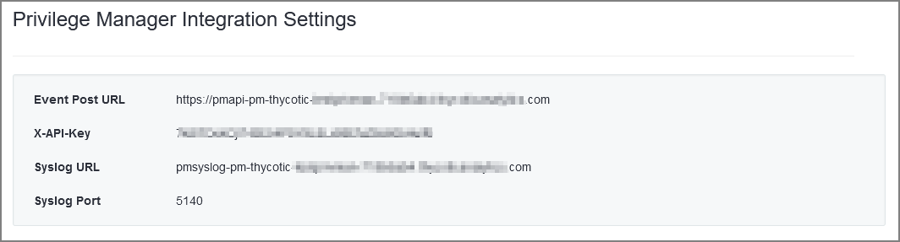
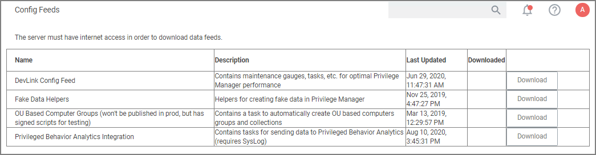
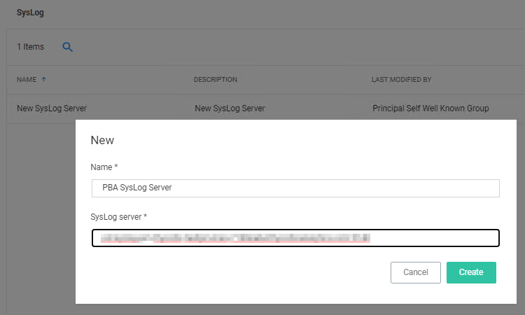
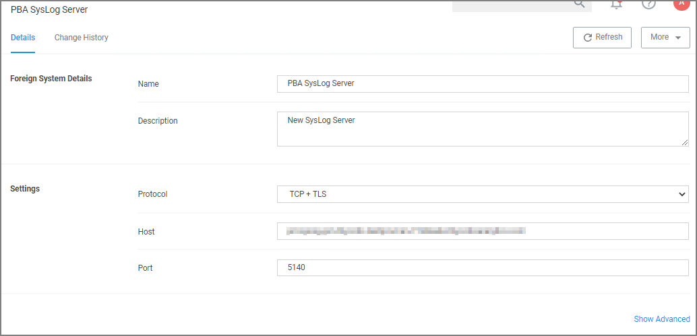
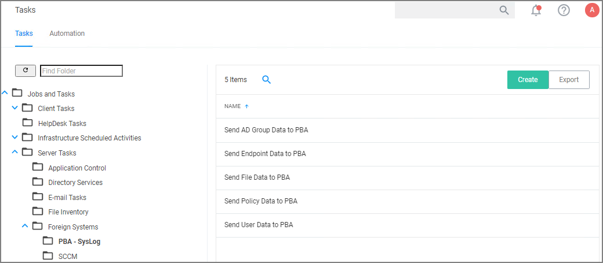
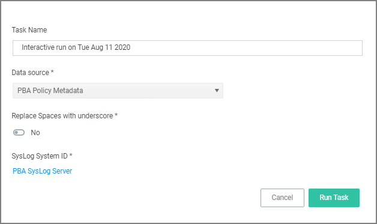
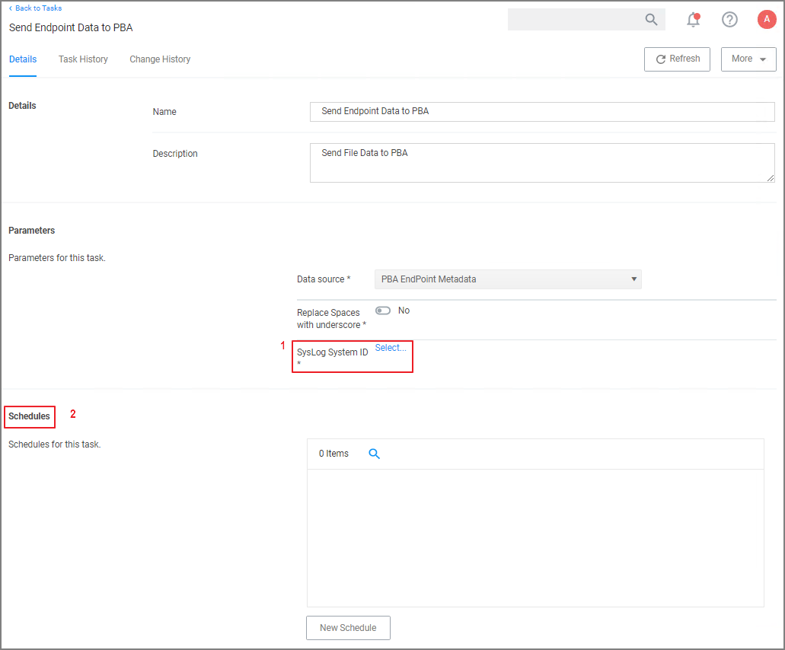
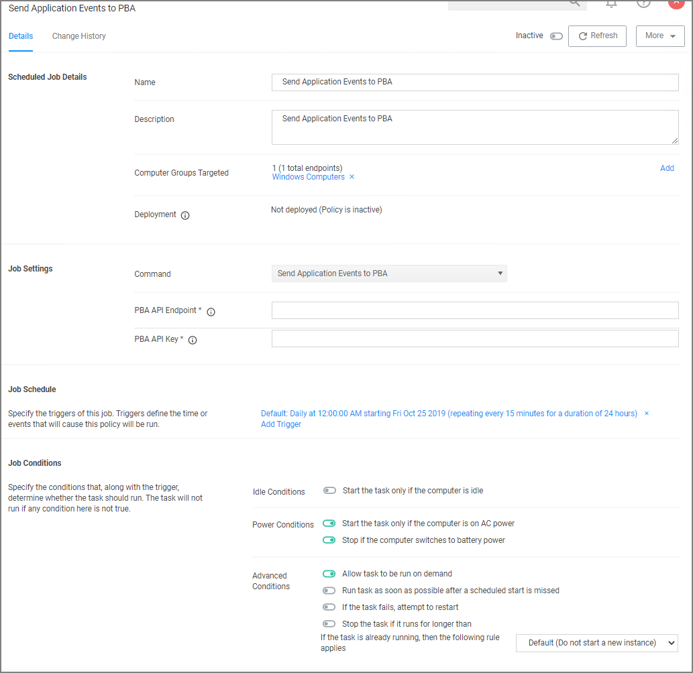

[title]: # (PBA Integration)
[tags]: # (integration,cloud only)
[priority]: # (3)
# Integration between Privilege Manager and Privileged Behavior Analytics

Thycotic's Privileged Behavior Analytics (PBA) SaaS product can be integrated with Privilege Manager cloud instances.

For the integration to work correctly independent of your Privilege Manager instance, you need to have a Thycotic enabled PBA instance.

Refer to the [PBA Documentation](https://docs.thycotic.com/pba/3.2.0) for details on features and functionality of PBA.

## PBA System Settings Details

You will need to retrieve the PBA System Settings details required for setting up the integration in Privilege Manager.

1. Navigate to the __PBA Systems Settings__ page (/system_settings/).

   
1. Use the Syslog URL and port information when setting up the __SysLog Foreign System__ below. Use the Event Post Url and the X-API-Key when setting up the __Send Application Events to PBA__ below.

## Setting Up PBA Integration on Privilege Manager

Required PBA resources are provided via Privilege Manager Configuration Feeds.

### Downloading and Installing the PBA Config Feed

1. In you Privilege Manager console, navigate to __Admin | Config Feeds__.
1. In the __Privilege Manager Product Configuration Feeds__ row click __Select Items__.
1. In the __Thycotic Management Server Core__ row click __Select Items__.
1. In the __Privileged Behavior Analytics Integration__ row click __Download__.

   

Once the table shows a date in the downloaded column and indicates a status of installed, proceed to the Foreign Systems setup.

### Setting up the PBA SysLog Foreign System

1. Navigate to __Admin | Config__ and select __Foreign Systems__.
1. Select __SysLog__.
1. Click __Create__.
1. Enter a name and your SysLog server details.

   
1. Click __Create__.
1. Verify that your Protocol, Host, and Port match your SysLog server details (SysLog URL and SysLog Port from the PBA System Settings details).

   

### Using the PBA Send Tasks

1. Navigate to __Admin | Tasks__ and from the folder tree select __Server Tasks | Foreign Systems__.
1. Click __PBA - SysLog__.

   
1. For Privilege Manager to send data based on any of these task, the PBA SysLog server you created as a Foreign System above, needs to be added as the SysLog System ID. This can either be done
   * __On Demand__ when running the task:  
     1. Select a PBA Data Send tasks and click __Run__.
     1. Specify the SysLog System ID.

        
     1. Click __Run Task__.
   * __By setting up a schedule__:
     1. Select a PBA Data Send tasks and click __View__.
     1. Under __Parameters__ specify the SysLog System ID.
     1. Define a __Schedule__, by clicking __New Schedule__

        
     1. Click __Save Changes__.

   Repeat for each of the data sets you want to use in PBA.

## Enable Send Application Events to PBA

The config feeds installation also add a remote scheduled client command for PBA to Privilege Manager. The __Send Application Events to PBA__ policy is by default disabled.

1. Under your computer Group navigate to __Scheduled Jobs__.
1. On the __Scheduled Jobs__ page search for PBA and select __Send Application Events to PBA__.

   

   * Under Job Settings enter the PBA __Event Post URL__ and __X-API-Key__ details from the PBA system settings information.
   * Modify the Job Schedule if customization is required.
   * Customize any of the Job Conditions to better fit your implementation.
1. Click __Save Changes__.
1. Set the __Inactive__ switch to __Active__.
1. Next to Deployment click the __i__ icon and select the __Resource and Collection Targeting Update__ task to run.
