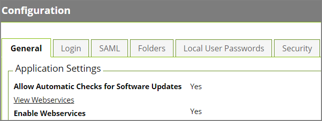
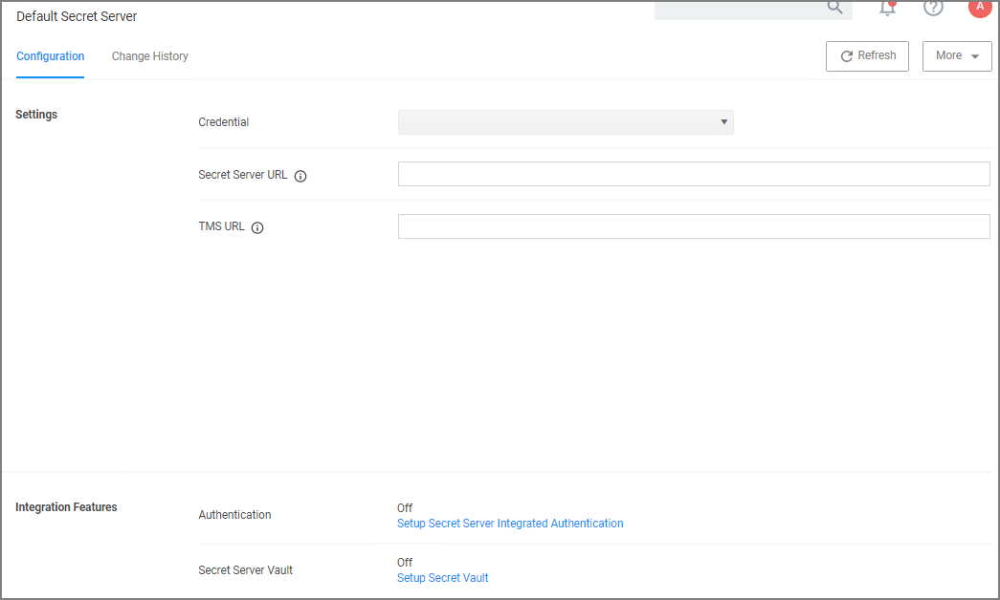
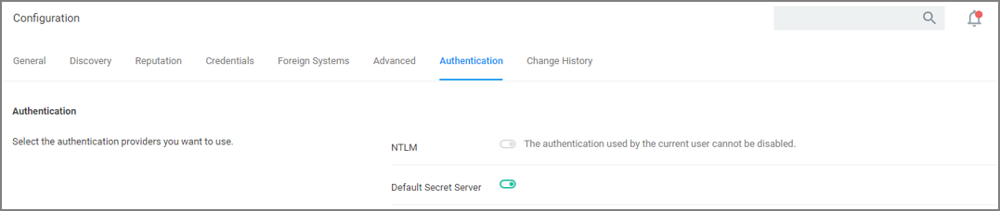
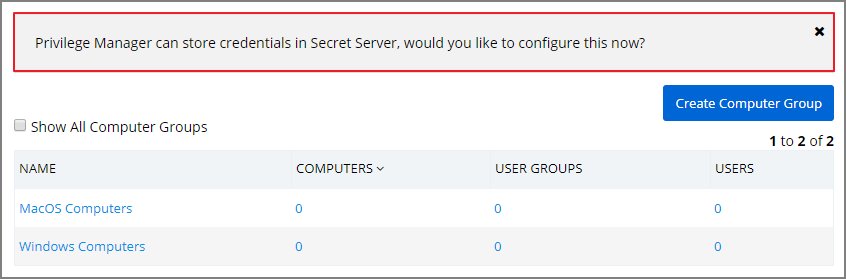
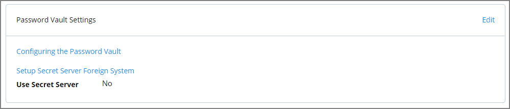
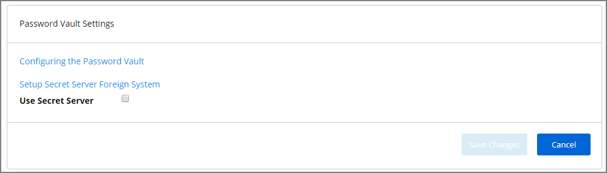
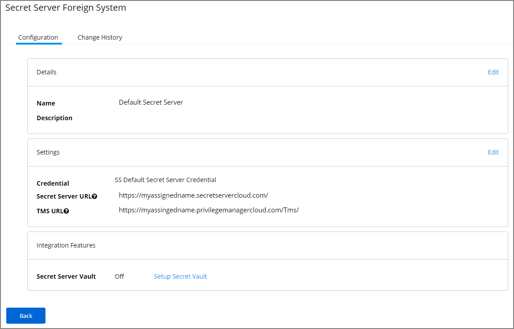

[title]: # (Privilege Manager and Secret Server)
[tags]: # (authentication,Integration)
[priority]: # (2)
# Setting up Integration between Privilege Manager and Secret Server

Privilege Manager has the ability to use Secret Server as its storage container for credentials. This includes credentials for connecting to integrated systems such as Service Now, as well as credentials for local accounts that are managed by Local Security in Privilege Manager. Customers can choose to integrate with Secret Server only (no Vault setup) or Secret Server and Vault. Either option requires Authentication Data setup for Foreign Systems in Privilege Manager.

The Secret Server Vault integration for 10.7.1 and newer does not require Secret Server to be setup as the authentication provider. Any supported authentication provider can be used, independent from using Secret Server as a Password Vault.

In Secret Server, Privilege Manager credentials are stored as Secrets, and Privilege Manager uses the Secret Server REST API to communicate with Secret Server.

For this the proper license types need to be set-up, as Secret Server Express (free) does not support the integration with Privilege Manager.

## Verify Web Services are Enabled in Secret Server

As a prerequisite, you need to make sure that your Secret Server instance has Web Services Enabled.

1. Navigate to __Admin | Configuration | Application Settings__.
1. Verify that under View Webservices the __Enable Webservices__ option is reflecting __Yes__.

   
1. Enter credentials for "Secret Server Default Credential" located at __Admin | Configuration | User Credentials__ tab. Edit this account to choose which account will be used by Privilege Manager to connect to Secret Server. This can be a regular Secret Server user or a Secret Server Application account.

>**Note**: The account needs to have a role with ALL of the following permissions.

| Permissions |
| ----- |
| Add Secret |
| Administer Configuration |
| Administer Folders |
| Administer Licenses |
| Assign Secret Policy |
| Create Root Folders |
| Delete Secret |
| Edit Secret |
| Own Secret |
| View Secret |

## Setup Authentication Data in Privilege Manager

1. Navigate to __Admin | Configuration__.
1. Click the __Foreign Systems__ tab.
1. Select __Secret Server__ from the list.
1. In the Name column click on __Default Secret Server__.

   
1. Under Settings, update the following:
   1. __Credential__: This is a Secret Server user (preferably an application account). Refer to required permissions above.
   1. __Secret Server Url__: This is the url that end users use to access Secret Server. __HTTPS__ is required. Also the validation on this field will reach out to Secret Server using the url provided. If it can’t be reached, or if the Secret Server version is lower than 10.6, there will be a 404 not found validation error. The URL needs to be fully qualified ending with a /.
   1. __TMS Url__: This is the url to access TMS itself. It is the url that end users use to access Privilege Manager, minus the PrivilegeManager/ part at the end of the path. This URL also needs to be well formed and fully qualified ending with a /.
1. Click __Save__.
1. Scroll down to __Integration Features | Authentication__ and enable Secret Server as the authentication provider by clicking the __Setup Secret Server Integrated Authentication__ link.
1. Set the switch for Secret Server to enabled.

   
1. Click __Save Changes__.

After these steps the Secret Server Foreign System is ready for use. If you need to enable or disable features for this integration, the Integration Feature list is below the Settings area on the page. Follow any of the links to turn features on and off.

<!-- TODO: Name/describe list of features and why a user would want to enable/disable them. Add screen captures. -->
  
## Configure Privilege Manager Credential Vault (optional)

1. Scroll down to __Integration Features | Secret Server Vault__ and setup Secret Server as the vault by clicking the __Secret Server Vault__ link.
1. Set the switch for the Vault to enabled.

   

   On the Password Vault Settings configuration page:
   1. Set the switch __Use Secret Server__ in order to use Secret Server’s vault to store credentials.
   1. Enter the username and password for the account that will be used to access Secret Server.
   
   >**Note**: These are the same credentials that will be stored as the Secret Server Default Credential (located at the __Admin | Configuration | Credentials__ tab). If a user already has been entered here, the same account will be auto populated into the configuration page.
1. Back on the __Password Vault Settings__ configuration page click __Save Changes__.

<!-- 1. In Privilege Manager on the home page select the __Local Security__ tile to go to Local Security page.
1. On the top of the Local Security page, click on the suggestion stating __Privilege Manager can store credentials in Secret Server, would you like to configure this now?__. For reference, the relative URL for this page is *TMS/PrivilegeManager/#/lss/vault* 
   

   The Password Vault Settings configuration page opens.
 
   
1. Select __Edit__.

   1. Check the box __Use Secret Server__ in order to use Secret Server’s vault to store credentials.

      
   1. Enter the username and password for the account that will be used to access Secret Server.

      
1. , click __Save Changes__. -->

## Password Migration

After the vault and authentication set-up, all passwords are migrated from Privilege Manager to Secret Server. This migration process may take time.

### Important Notes

The migration will create a root folder in Secret Server named Privilege Manager Secrets. Do NOT delete this folder. The folder, by default only has the sync account user as an owner, with no other permissions.
The permissions on this folder can be modified to allow helpdesk users or administrators access to the Secrets. Do NOT remove the sync account user’s permissions from the folder.

If desired the folder can be moved or renamed within Secret Server.

## Templates

There are two Templates that Privilege Manager uses to store Secrets in Secret Server. These templates must exist with the proper fields and be marked as active.

* __Password (Template Id: 2)__: The following fields need to exist on the template:

  * Username
  * Password

  Do NOT mark any other fields in that template as required!

* __Windows Account (Template Id: 6003)__: The following fields need to exist on the template:

  * Machine
  * Username
  * Password

  Do NOT mark any other fields in that template as required!

>**Note**:
>To troubleshoot or remove the integrated configuration, navigate to the __Admin | Configuration | Advanced__ tab in Privilege Manager. Locate the __System Secret Vault__ setting and click the __Select Resource__ link. Here, a user can manually add and remove the Secret Server vault. If you choose to remove the Secret Server vault, a migration of passwords from Secret Server’s vault to Privilege Manager automatically happens.
