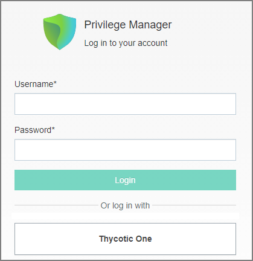
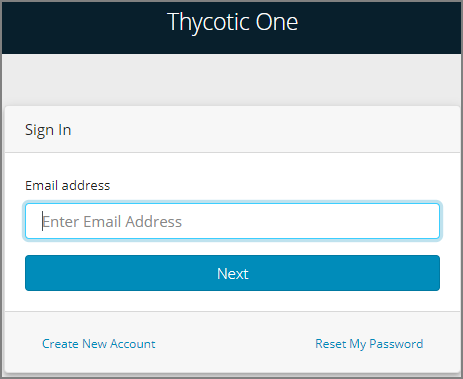
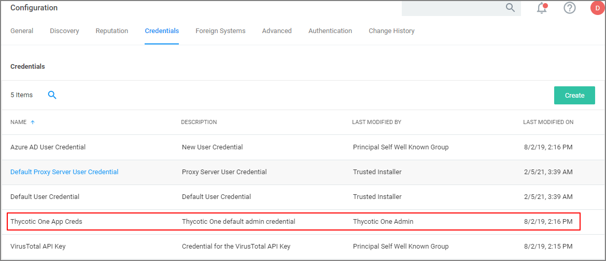
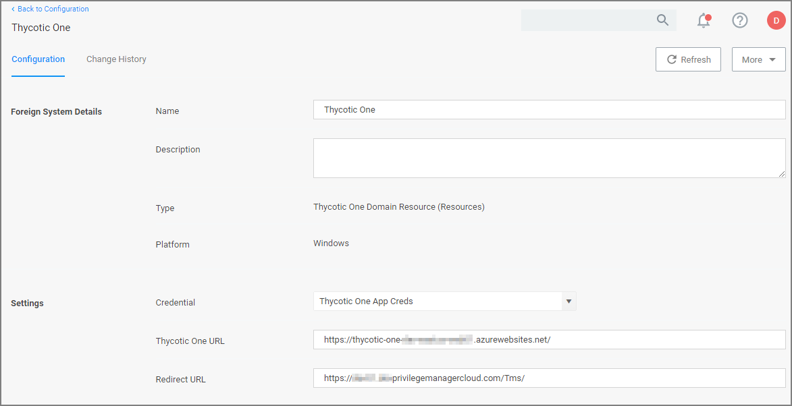

[title]: # (Thycotic One)
[tags]: # (relink,foreign systems)
[priority]: # (10)

# Thycotic One and Privilege Manager

## Overview

Thycotic One is the single-sign-on provider for Thycotic applications. With Thycotic One, one user account can be granted access to multiple Thycotic products, such as Secret Server, Privilege Manager, DevOps Secrets Vault, and Account Lifecycle Manager.

Thycotic One enables login integration using the OpenID Connect protocol, an industry standard single-sign-on method.

Thycotic One is the default identity provider in Privilege Manager Cloud (PMC). When you set up the cloud instance, it will already be configured and ready to use Thycotic One. The initial admin user will log in with their Thycotic One account, and optionally, all newly created [Privilege Manager accounts](../../../../users/index.md#how_to_manually_add_thycotic_one_users) can be synchronized with Thycotic One, so they can log in that way as well.

##  Logging in with Thycotic One

When Thycotic One integration is turned on, all Privilege Manager users can log in either with their local passwords or with Thycotic One. All Privilege Manager permissions and configuration will apply to that user regardless of how they logged in.

However, the local username and password and the Thycotic One username and password are not necessarily the same thing. In Thycotic One, you’ll log in with your email address rather than your username, and the password you use may very well be different from the Privilege Manager password.

You’ll see this on the login page:

Clicking __Local Login__ will bypass Thycotic One and allow the user to log in with their local Privilege Manager password. Clicking __Thycotic One__ will redirect the user to Thycotic One to authenticate. Once that is successfully done, the user will be redirected back to Privilege Manager.

After clicking __Thycotic One__, users will type their email address and password:

And then be redirected back to their dashboard in Privilege Manager.

## Configuring Thycotic One as a Foreign System

Thycotic One related configuration details can be accessed under __Admin | Configuration__. Two items can be customized:

* Credential: This credential is used by the Thycotic One Foreign System.
* The Thycotic One Foreign System.

### Editing up the Credential

1. Navigate to __Admin | Configuration__.
1. Select __Credentials__.
1. Click __Create__  to create a new credential to use with Thycotic one or edit details on the existing one. Make sure to provide the correct Thycotic One account name and password information.
1. Click __Save Changes__

Your Thycotic One credential is listed on the __Credentials__ tab.

### Editing the Foreign System

The Thycotic One Foreign System entry is auto-populated based on the information provided during the registration process as documented in the [Cloud Quickstart Guide](../../../../../getting-started/cloud/cloud-quickstart.md).

The following steps show how to access the foreign system for edits.

1. Navigate to __Admin | Configuration__.
1. Select __Foreign Systems__.
1. Select __Thycotic One__.

   
1. Customize the Name and Description.
1. Under __Settings__ you may edit:
   1. __Credential__: This is the name of the credential that you created for Thycotic One based on the previous procedure.
   1. __Thycotic One URL__: This is the URL for Thycotic One that is based on the region selection during the setup process.
   1. __Redirect URL__: This is the URL to your specific Privilege Manager Cloud instance.  

   
