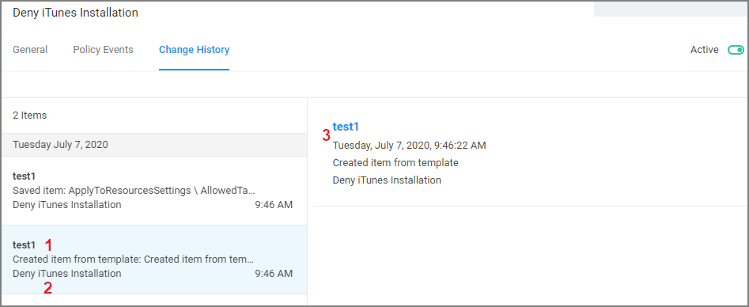
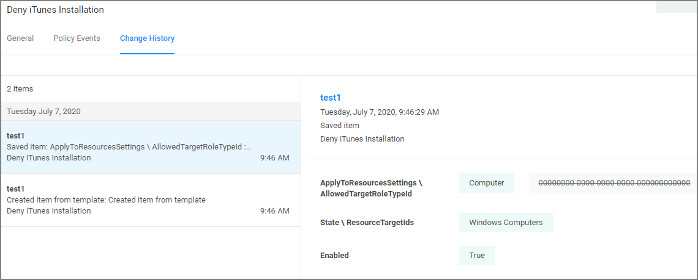
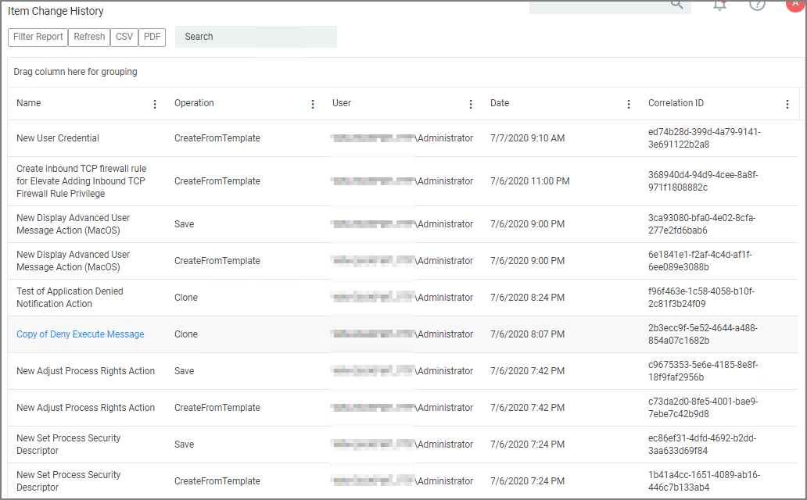

[title]: # (History Tab)
[tags]: # (user interface,console,overview)
[priority]: # (1)
# History Tab

The Change History tab is accessible via:

* __Admin | Configuration__ – listing all changes made to Advanced, Authentication Provider, Foreign Systems, Discovery, and Reputation item configuration settings.
* __Admin | Policies__ – listing all changes made to policies.
* Admin | More and then (for the default menu, might differ if customized)
  * __Filters__ – listing all changes made to a specific filter.
  * __Actions__ – listing all changes made to a specific action.
  * __Resources__ – listing all changes made to a specific user editable resource. Meaning resources that are not user editable, like a file extension, do not have a history change tab.
  * __Tasks__ – listing all changes made to a specific task.
<!--  * __Tools | File Upload__ – listing all file uploads. -->

Once the tab is selected, it opens a two-column page. On the left all recorded changes are listed with the newest record on top. This left column data provides a summary of the changes:

* who made the change,
* what was changed,
* the type of change,
* item changed, and
* date/time of the change.

For any changes made to the Authentication Provider for Foreign Systems, like changing from NTLM to Azure Active Directory for example, the Change History provides details about the active and staged states with true and false indicators.

## Looking at Details

The following image shows an example of the change history for a foreign system entry. The change shows that the foreign system was initially pointed at the local host URL, with a Credential and Client Secret pertaining to that localhost instance. An update was made to configure a real Secret Server instance URL with accompanying changes of Client Secret and Credential to be able to authenticate against that new URL.

### Drilling Down

To look at details of any given change, select one of the change entries in the left column. For the example we created a policy to deny the installation of iTunes on Windows endpoints. 

What we see:

1. Information about the system and user initiating the change, here _test1_ and information about the type of change, here Created from template.
1. The name of the item that was created from template, the date and time when the change ocurred.
1. Details on the summary information from the left, such as a link to view the user details and what change was done to which item.

The next screen shows a state change due to the policy being saved. The State\ResourceTargetIds are being saved for the first time for this policy.

The last entry in the Change History list provides all the details about the change to the policy after initial creation and save.

<!--

What we see:

1. The left-hand summary indicates that Application targets were set to iTunes and three other changes were made.
1. Application targets (+) iTunes indicates that iTunes was added as an Application target. A (-) would indicate a removal of an application target.
1. ApplyToResourcesSettings\AllowedTargetRoleTypeId indicated that the previous zero value Id was changed to a value of Computer.
1. The State\ResourceTargetIds field was populated with the value All Windows Computer with Application Control Agent Installed (Target).
1. The last change was setting the policy Enabled state to True. -->

## Item Change History Report

The [Item Change History Report](../../reports/change-history.md) is part of the __Diagnostic__ group on the Reports page. You can also search for “change history” and the report will be listed on the search results page. Click the link to access the report.

The report lists the history of item changes.

For further investigation, you can access the item that was changed by clicking the entries in the Name column.
