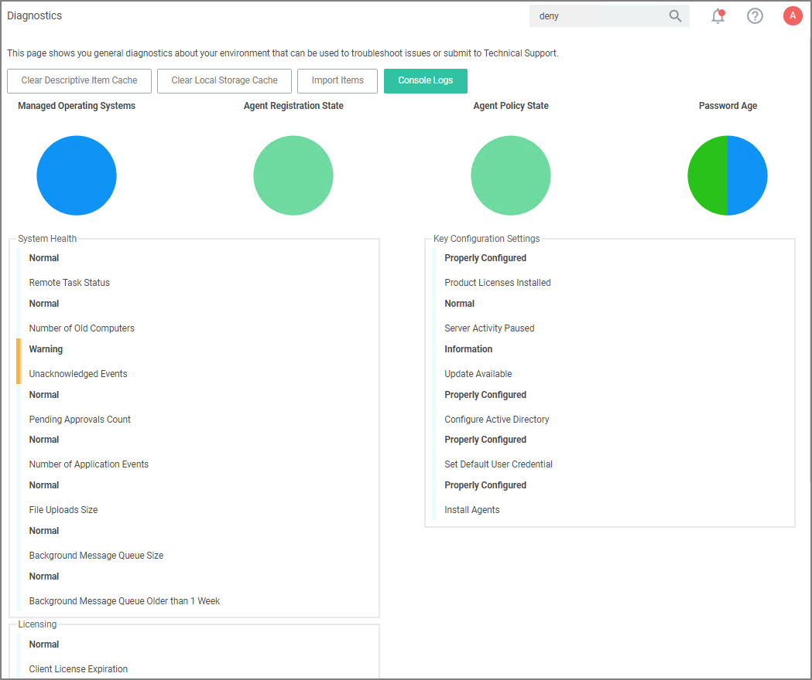

[title]: # (Diagnostics Page)
[tags]: # (troubleshooting)
[priority]: # (4)
# Diagnostics Page

Navigate to the __Admin | Diagnostics__ page to view more comprehensive system details. Select any of the gauges to drilldown into details.

The Diagnostics page is also the go-to stop for full system health. Go there to find Server Console Logs and other system level warnings or tips.

The Licensing area provides information about expired licenses, exceeded license counts, and limits for each operating system.
