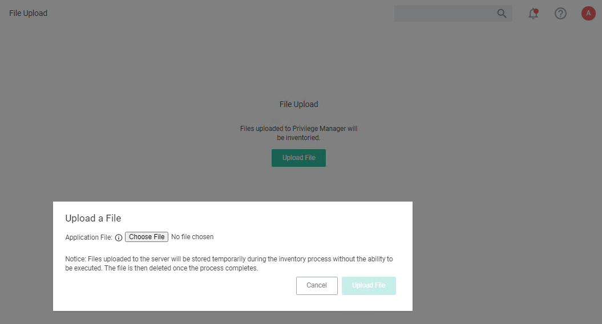

[title]: # (File Upload)
[tags]: # (operations)
[priority]: # (5)
# File Upload

The File Upload options allows existing file uploads via the standard Choose File dialog.

The file upload functionality is available during imports of items, for diagnostics, and for inventory purposes.
