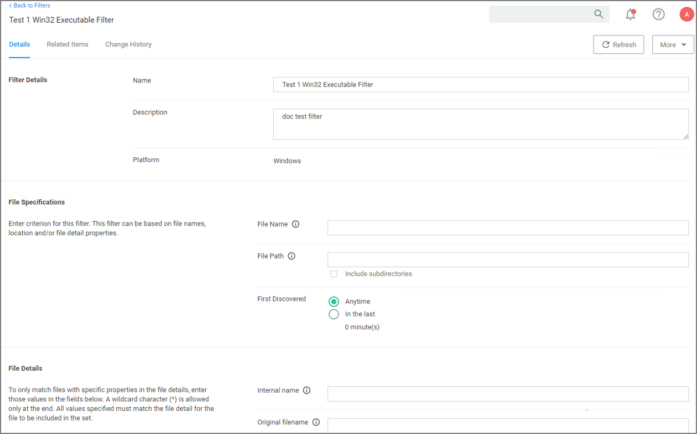

[title]: # (Blank Win32 Executable)
[tags]: # (filter types)
[priority]: # (2)
# Blank Win32 Executable Filter

Identifies specific application files by specifications like name, path, and when first discovered.

## Parameters

Win32 Executable filters have two sets of parameters:

* __File Specifications__, such as

  * File Name
  * File Path with option to include subdirectories
  * First Discovered, which can specified as "Anytime" or "In the last" either Minutes, Hours, Days, or Weeks.

* __File Details__ (common attributes), such as

  * Internal name
  * Original filename
  * File version
  * Product name
  * Product version
  * Company name
  * Copyright (version 10.7 and up)

## Examples

Used to target specific applications, for example allowing acrobat.exe or notepad++.msi to be used on endpoints.
