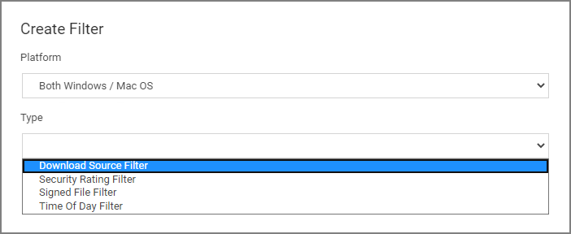
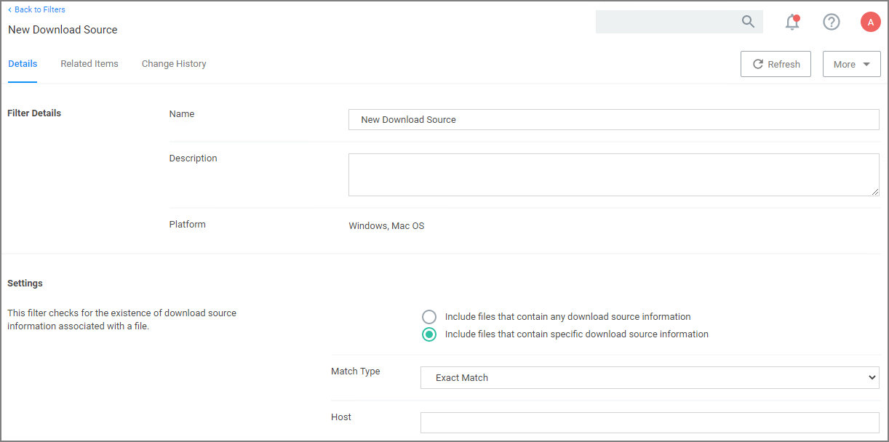

[title]: # (Download Source)
[tags]: # (filter types)
[priority]: # (2)
# Download Source Filter

The filter checks where a file is being downloaded from. This filter allows you to identify specific download sources, and allows the ability to allow list sources you trust or block sources you don't. *No out-of-box filters exist in Privilege Manager for this type*.

This filter is available for both Windows and macOS systems.

## Parameters

The filter checks for the existence of download source information associated with a file.

__Settings__:

* Include files that contain any download source information
* Include files that contain specific download source information
* Match type
* Host

## Examples

This filter would allow you to control what download sources should be allowed or blocked.
