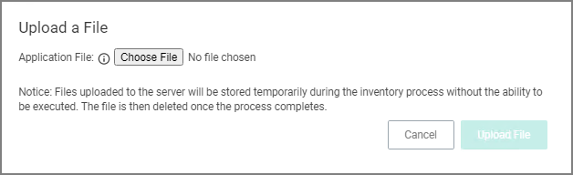
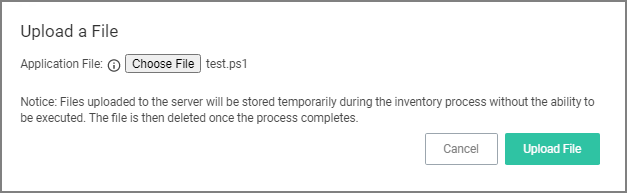
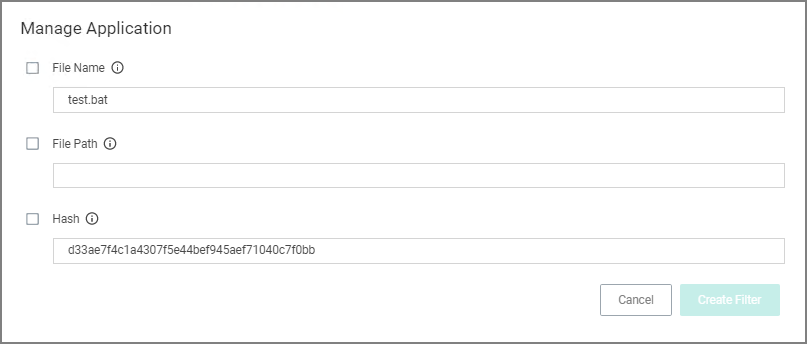
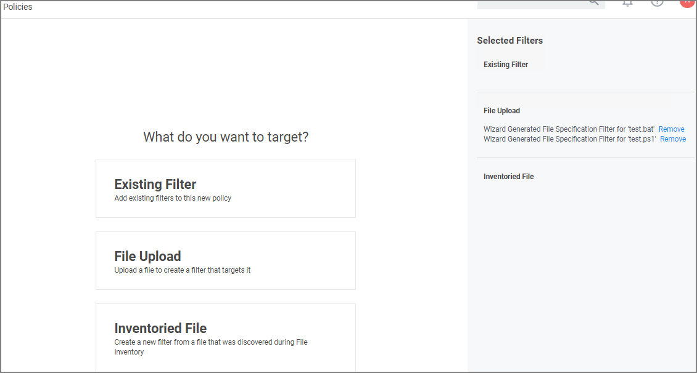
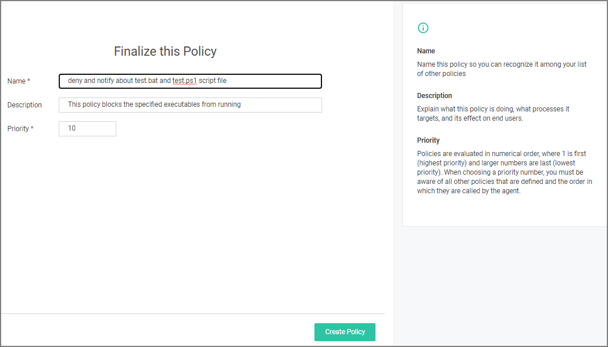
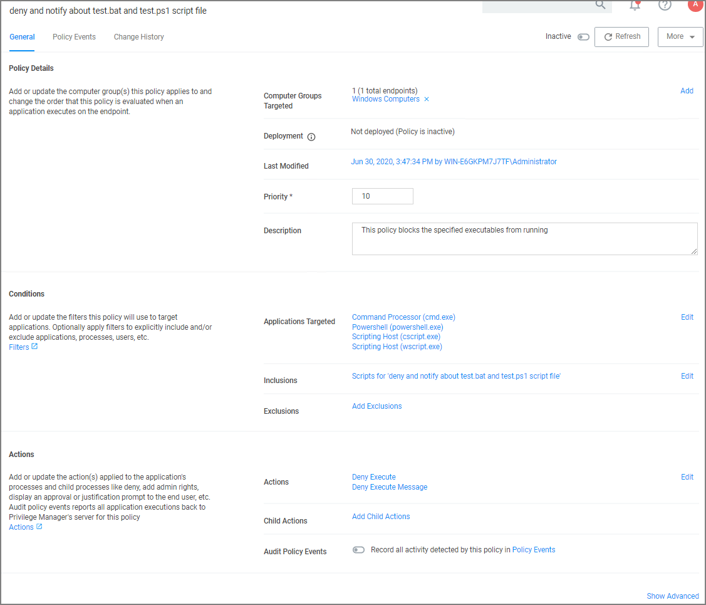
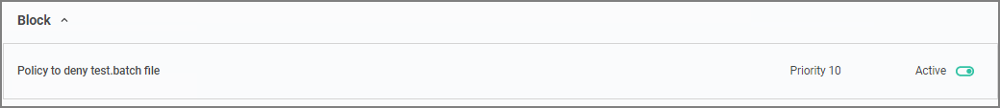
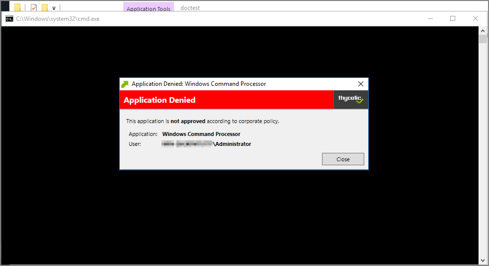
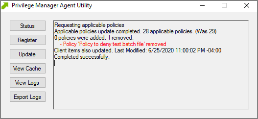
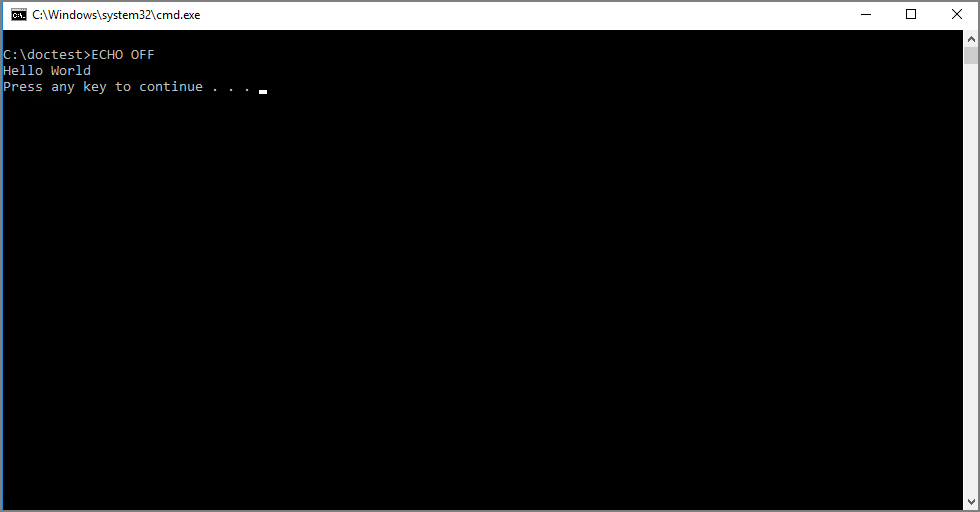

[title]: # (Script Execution)
[tags]: # (secondary file filter)
[priority]: # (2)
# Script Execution File Example

In this example we are creating a policy to deny running a batch or ps1 file, which the policy targets through a secondary file filter.

This example is for a Windows endpoint, but the policy can be created in the same way for a macOS system.

## Creating the Policy

1. Navigate to __Computer Groups | Windows Computers__.
1. Select __Application Policies__.
1. Click __Create Policy__.
1. In the policy wizard select __Controlling__, click __Next Step__.
1. In the policy wizard select __Block__, click __Next Step__.
1. In the policy wizard select __Notify and Block__, click __Next Step__.
1. In the policy wizard select __Script__, click __Next Step__.
1. In the policy wizard select __File Upload__.
   1. On the Upload a File modal, Click __Choose File__.

      
   1. Select the file(s) you wish to be targeted. For this example we are first uploading a test.bat and then test.ps1 file. You need to run through the upload and manage application steps twice, once for each file you are uploading.

      
   1. Click __Upload File__.
   1. On the Manage Application dialog, check __File Name__.

      

      Select more details like the File Path or the Hash, if you want to make this policy more specific.
   1. Click __Create Filter__.

      
   1. Click __Next Step__.
1. On the Finalize the Policy page, enter a name for your new policy. The policy will be created with a default priority of 10, since it is a deny and notify policy.

   
1. Click __Create Policy__.

   

The policy wizard added based on the selected file uploads and the file inventory that was executed 4 types of application targets:

* Command Processor (cmd.exe)
* Powershell (powershell.exe)
* Scripting Host (cscript.exe)
* Scripting Host (wscript.exe)

A secondary file filter was added under Inclusions, identifying two specific file filters for the test.bat and test.ps1 files.

## Verifying the Policy Works

1. Add a test.bat file with a simple Hello World command to your system.
   1. Create a new text file and add
   
      ```bash
      ECHO OFF
      ECHO Hello World
      PAUSE
      ```
   1. Save the file as test.bat.
1. With your policy set to __active__, double-click the test.bat file.

   

   The policy triggers the specified message action:

   
1. With your policy set to __inactive__, verify via Agent Utility that the update was received and the policy was removed:

   
1. Double-click the test.bat file.

   

   The batch file is executed and Hello World is printed to the cmd.exe output window.