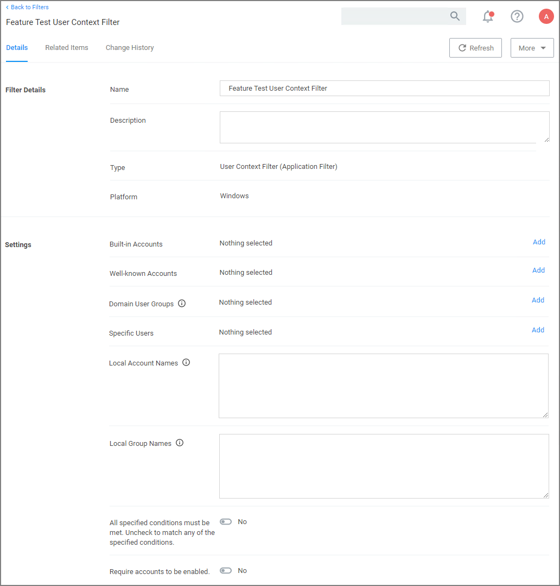
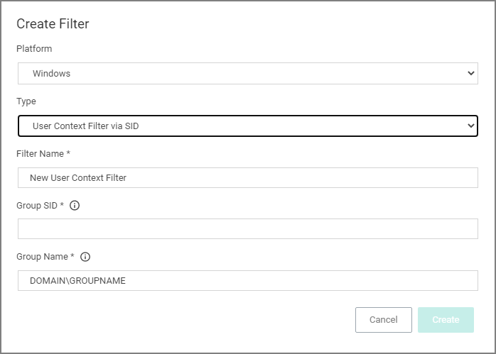
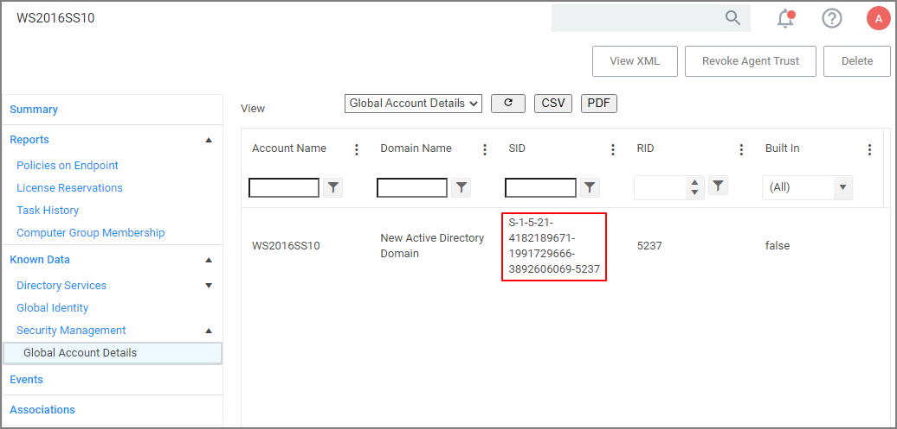
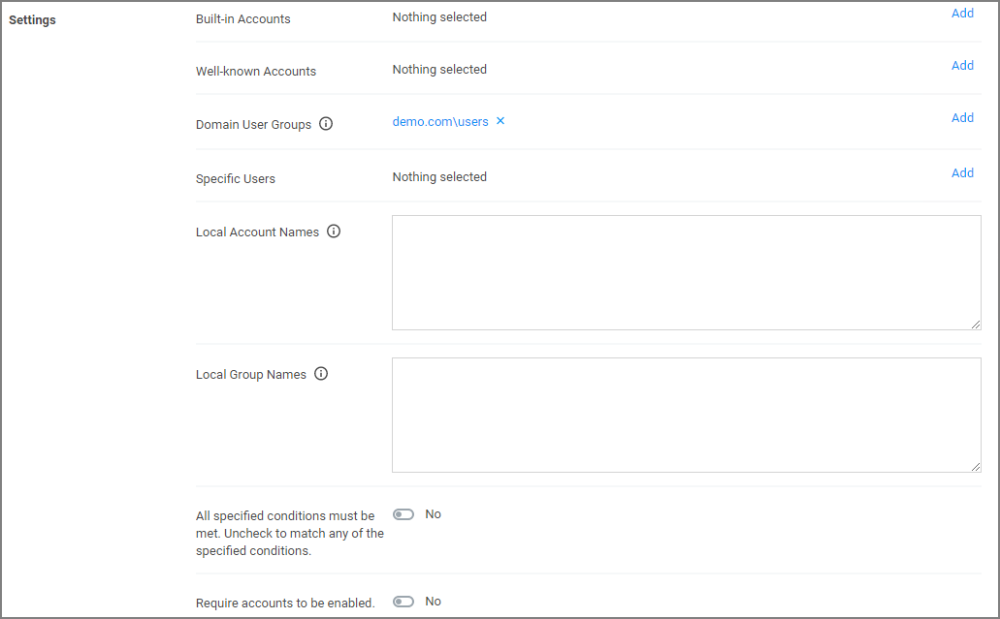

[title]: # (User Context)
[tags]: # (sid, active directory, azure AD)
[priority]: # (2)
# Using User Context Filters

User Context Filters are used in a policy as either an

* inclusion filter, to specify that the policy only applies to users in a specific AD Group.
* exclusion filter, to specify that the policy applies to everyone except the users in a specific AD Group.

The User Context Filters are part of the Application Filter templates listed for Windows:

This filter is available for both Windows and macOS systems.

On Windows 10 endpoints, the filter ensures that Azure AD security groups can be targeted within Windows-based User Context Filters computers that are __only__ joined to Azure AD.

## On-Premise

For Privilege Manager on-premises, the __User Context Filter__ can be used after the Active Directory synchronization completes. When creating and editing the filter, add any 

* Built-in Accounts,
* Well-known Accounts, and/or
* Domain User Groups, for which you may need to run the Active Directory sync task to update available users and groups, or
* Specific Users,
* Local Account Names,
* Local Group Names

to specifically select user context.

Then set the __All specified conditions must be met__ switch to __Yes__, if __ALL__ conditions must be met. Leave the switch set to __No__ to match __ANY__.

You can also specify if accounts must be enabled to be targeted. This is an important checkbox to set if specific users have been added.

## Cloud

For Privilege Manager Cloud, the __User Context Filter via SID__ can be used if (Azure) AD synchronization has not been set up but the SID of the group is known. When creating the filter, 

enter the

* __Group SID__, which you can find under the Global Account Details for a given resource:

  
* __Group Name__, to name the group if it does not exist.

