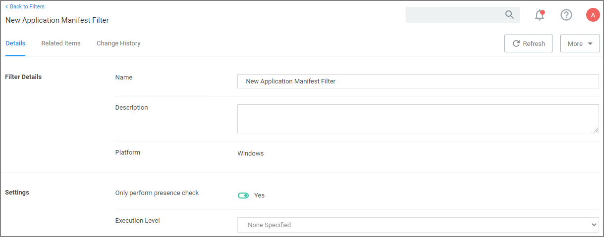

[title]: # (Application Manifest)
[tags]: # (filter types)
[priority]: # (2)
# Application Manifest Filter (“Manifest Filter”)

Applications that declare specific rights required via a manifest, such as applications that need administrative privileges.

## Parameters

By default __Only perform presence check__ is set to Yes, if you change this to No, you can specify the __Execution Level__ as either:

* As Invoker
* Highest Available
* Require Administrator

Remember to __Save Changes__ after any customization.
