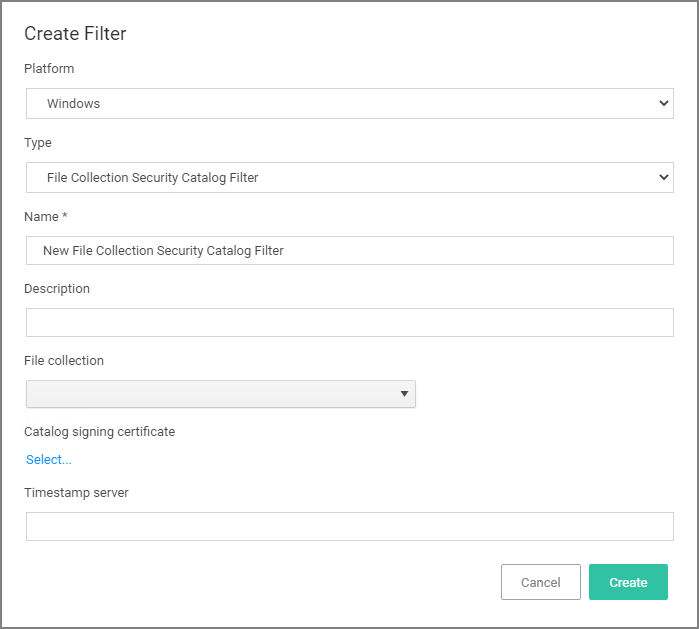
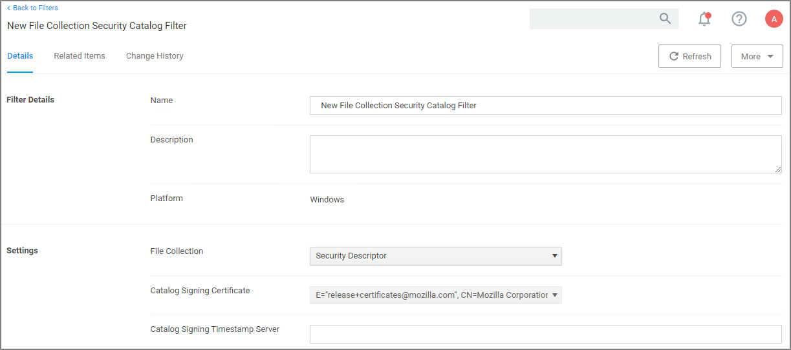

[title]: # (File Collection Security Catalog)
[tags]: # (filter types)
[priority]: # (2)
# File Collection Security Catalog Filter

This is a special collection of files allow or deny list. This filter type is similar to other Inventory Filters, particularly our Security Catalog Filter. *No out-of-box filters exist in Privilege Manager for this type*.

You can use these filters to target executables found in security catalogs. The built-in filter targets the Signed Security Catalog (\Windows\System32\catroot\) and is typically used to automatically allow list applications from Microsoft.

## Parameters

* File collection, this is the specific catalog you want to use.
* Catalog signing certificate, select the specific certificate from a list.
* Timestamp server, specifies a particular version to be used.

