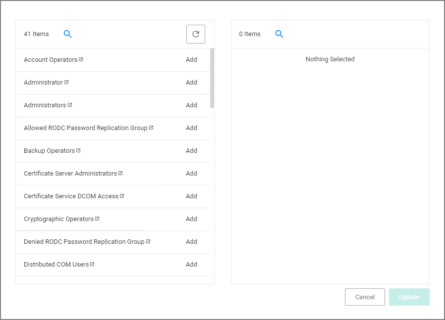
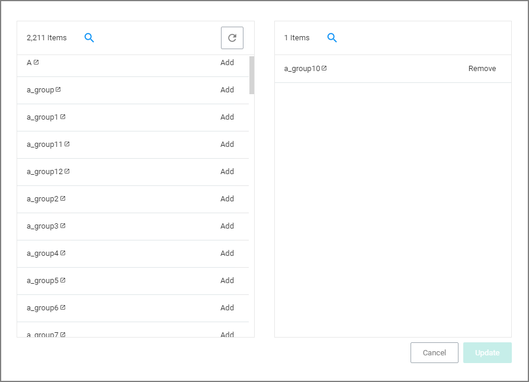

[title]: # (File Owner)
[tags]: # (filter types)
[priority]: # (2)
# File Owner Filter

This filter identifies files based on ownership.

This filter is available for both Windows and macOS systems.

## Parameters

Under settings you specify to include only those files with an owner having certain accounts or being part of certain domain user groups.

* Build-in Accounts

  
* Well-known Accounts

  
* Domain User Groups

  

Remember to click __Update__ and __Save Changes__ following any customization.
