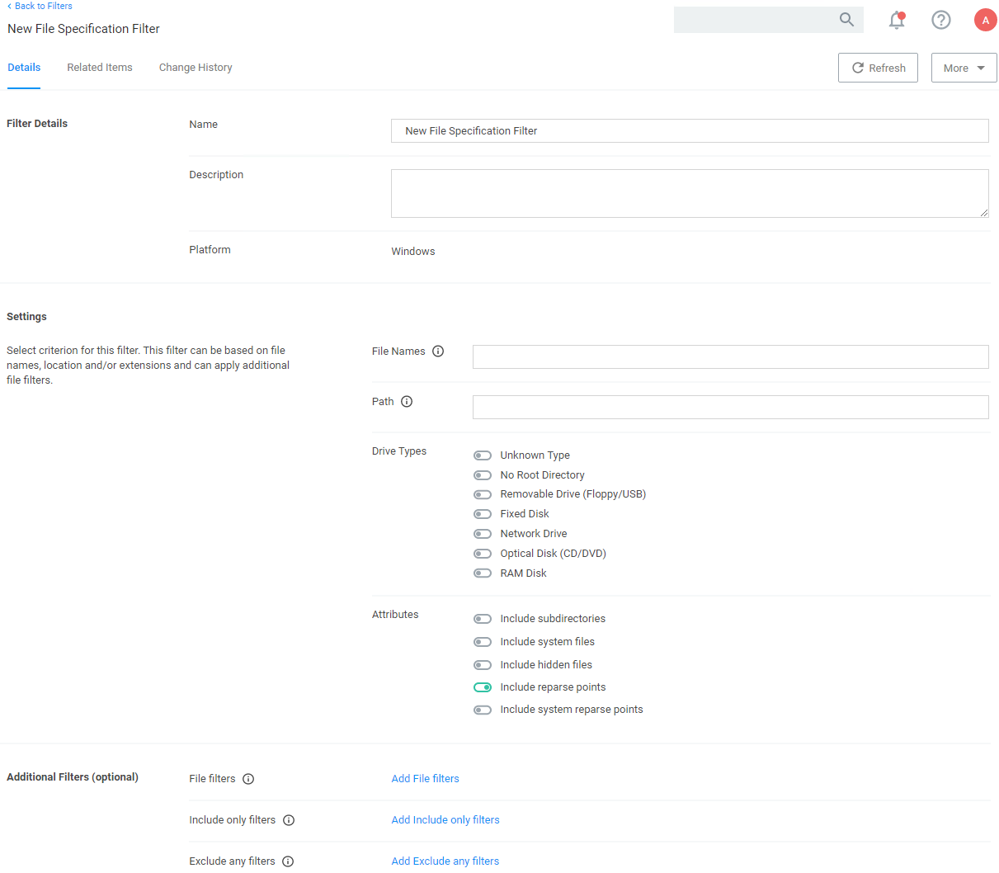

[title]: # (File Specification)
[tags]: # (filter types)
[priority]: # (2)
# File Specification Filter

This filter identifies files based on their file name, extension, path, or location on a computer.

This filter is available for both Windows and macOS systems. Use this filter for macOS endpoints only to target known scripts or command-line tools; otherwise use the [Default File Specification (macOS)](../macOS/file-specification.md) filter.

## Parameters

* File Names
* Path
* Drive Types
* Attributes, include reparse points is the only default enabled attributes

### Additional Filters

Additional Filters can be added optionally.

* File filters, at least one of the filters added here must match.
* Include only filters, all of the filters added here have to match.
* Exclude any filters, any matching filters added here will be excluded.
