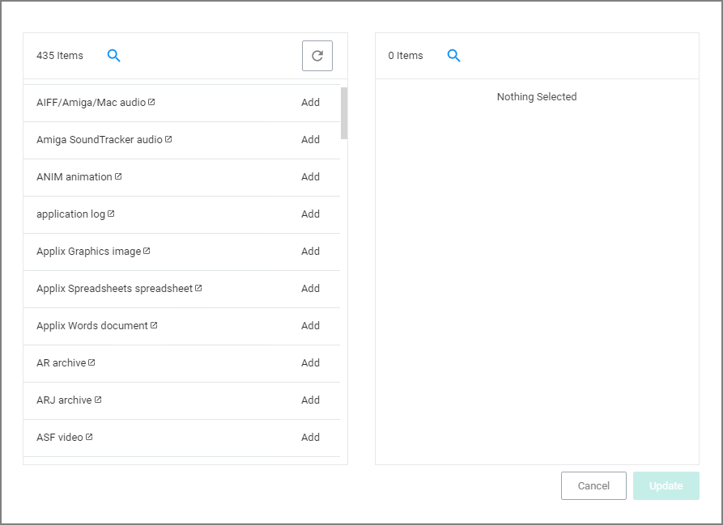

[title]: # (File Type)
[tags]: # (filter types)
[priority]: # (2)
# File Type Filter

This filter identifies files based on what type of file it is. *No out-of-box filters exist in Privilege Manager for this type*.

## Parameters

* File Extensions

  
* MIME Types

  

Add the parameters, click __Update__ and __Save Changes__.
