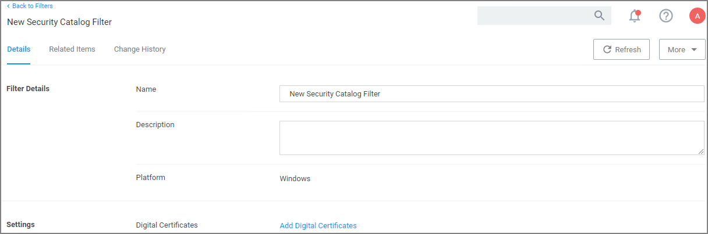
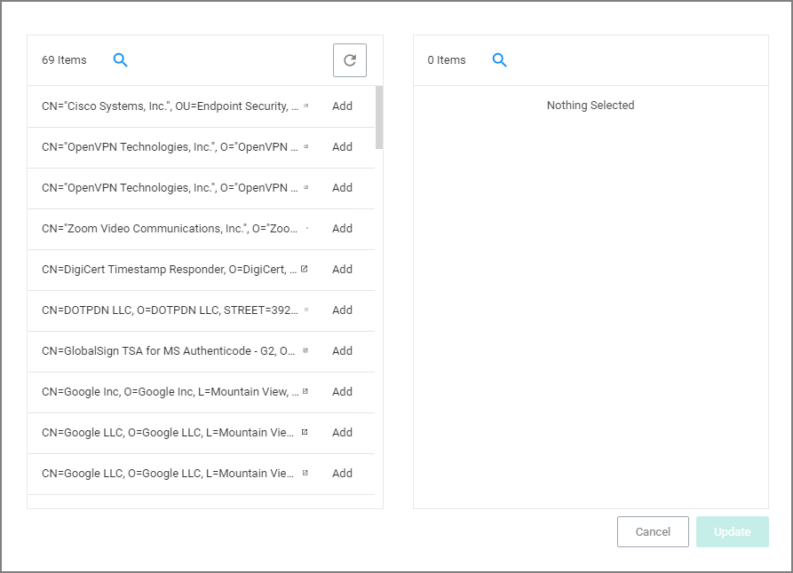

[title]: # (Security Catalog)
[tags]: # (filter types)
[priority]: # (2)
# Security Catalog Filter

This is a special collection of files to allow or deny list. For example, the Microsoft Security Catalog is often allow listed as a trusted catalog.

## Parameters

* Digital Certificates

  
