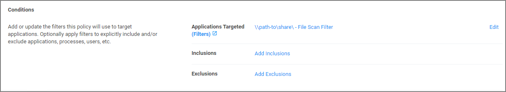
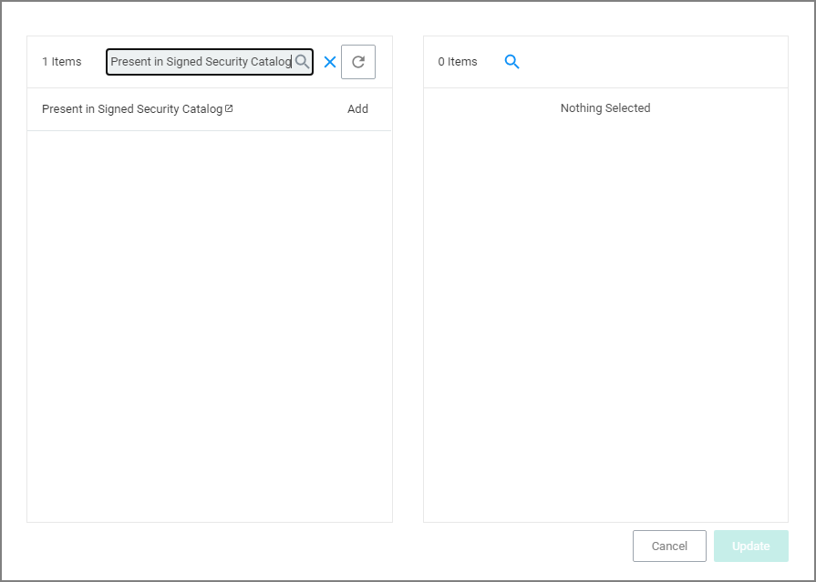

[title]: # (Unlocking via Security Catalog)
[tags]: # (filter types)
[priority]: # (2)
# Unable to Access Cortana and Search for Windows 10

This issue might be due to the __Present in Signed Security Catalog__ not being added to the __Exclusion Filters__ section in a policy.

## How to Resolve

1. Launch __Privilege Manager__ and navigate to your __Application Policies__.
1. Click on a previously created policy.
1. Under __Conditions__, next to Exclusions select __Add Exclusion Filter__.

   
1. Search for __Present in Signed Security Catalog__.

   
1. Click __Add__ next to the __Present in Signed Security__ filter.
1. Click __Update__.
1. Click __Save Changes__ on the policy page.

   >**Note**: Once the agents check back into the web console which by default occurs every 30 minutes, the machines will get the new policy changes. However if you would like to test the policy update on a specific machine, please continue.
1. Go to the Machine(s) where you want to update the policy and open the Agent Utility.

    e.g., `C:\Program Files\Thycotic\Agents\Agent`
1. Click __Update__.
