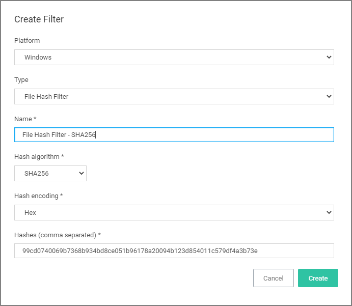
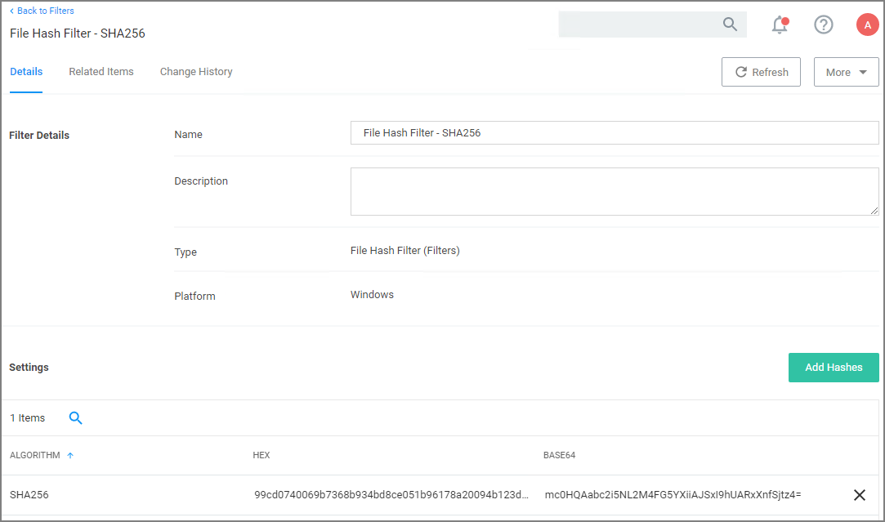
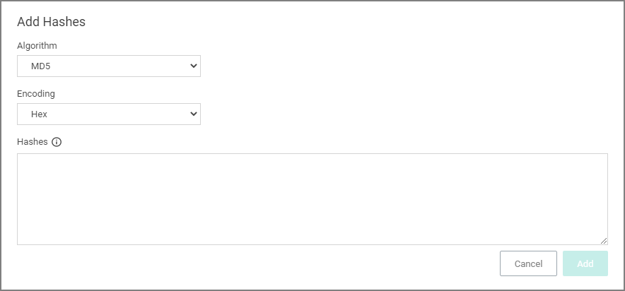

[title]: # (File Hash Filter)
[tags]: # (filter types, inventory)
[priority]: # (2)
# File Hash Filter

This type of filter identifies file inventory based on Secure Hash Algorithms. *No out-of-box filters exist in Privilege Manager for this type*.

When creating this filter the target hashes need to be entered as a comma-separated list:

This filter is available for both Windows and macOS systems.

## Required Parameters on Filter Creation

* __Hash algorithm__ drop-down, only one can be specified per filter:
  * MD5
  * SHA1 (only for backwards compatibility - should not be used anymore!)
  * Authenticode
  * SHA256
  * Authenticode 2

* __Hash encoding__ dorp-down:
  * Hex
  * Base64

* __Hashes (comma separated)__ text field.

## Example of SHA256 Filter

Once the filter is created, the following settings can be viewed and/or edited:

* __Algorithm__, in hex and base64 format. Algorithms and hashes can be added via the __Add Hashes__ button.

