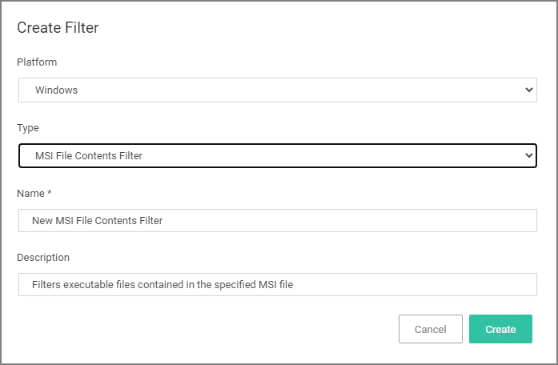
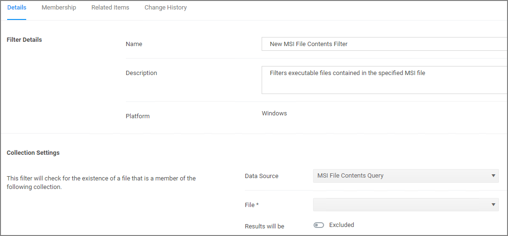
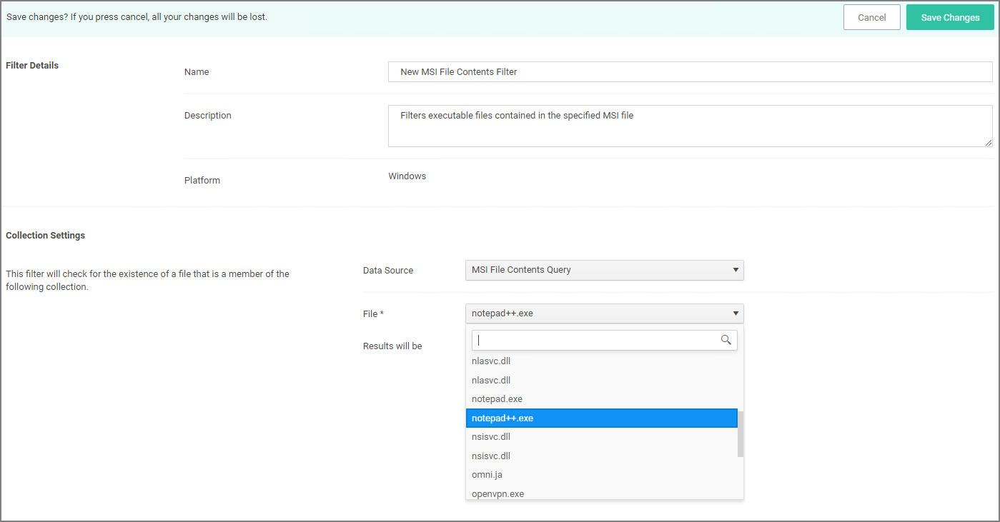

[title]: # (MSI File Contents)
[tags]: # (filter types)
[priority]: # (2)
# MSI File Contents Filter

This type of filter identifies file inventory based on .MSI file contents, i.e. specific Windows package installers. *No out-of-box filters exist in Privilege Manager for this type*.

## Parameters

Once the filter is created the following settings can be viewed and/or edited:

* Data Source, (__do not edit__) this is the MSI File Contents Query.
* File:

  * Parameters (these are required)

    * Win32 Executable
    * Product Name
  * Select Resource, this is the actual MSI file resource that has to be selected for the scan.
* Results will be either excluded (default) or included.

### Viewing, Editing, and Saving the Parameters

