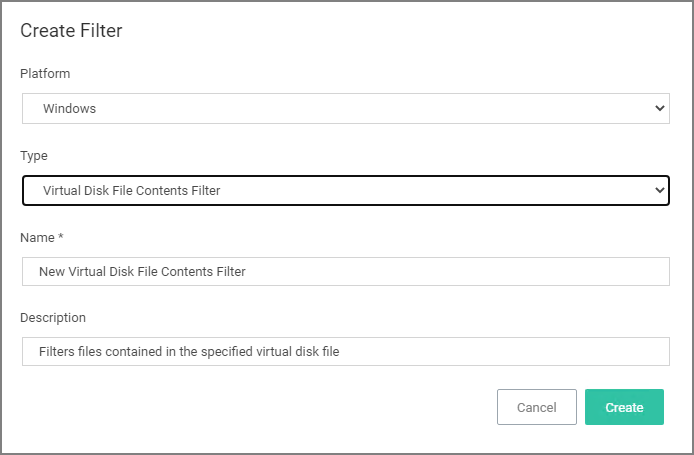
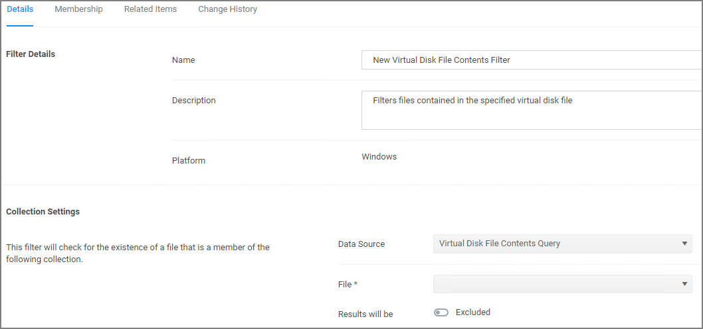

[title]: # (Virtual Disk File Contents)
[tags]: # (filter types)
[priority]: # (2)
# Virtual Disk File Contents Filter

The Virtual Disk File Contents Filter filters files contained in the specified virtual disk file. *No out-of-box filters exist in Privilege Manager for this type*.

## Parameters

Once the filter is created the following settings can be viewed and/or edited:

* Data Source, (__do not edit__) this is the Virtual Disk File Contents Query.
* File, this is the actual virtual disk file resource that has to be selected for the scan.
* Results will be either excluded (default) or included.

