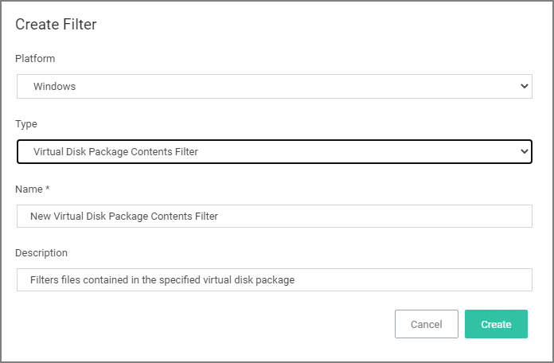
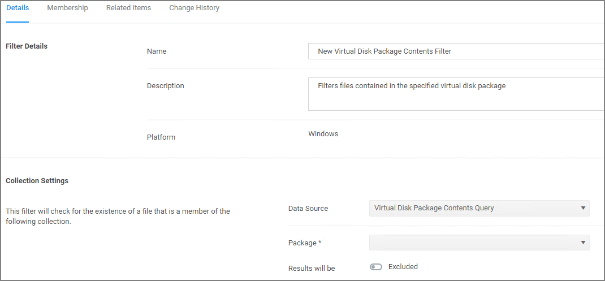

[title]: # (Virtual Disk Package Contents)
[tags]: # (filter types)
[priority]: # (2)
# Virtual Disk Package Contents Filter

Filters files contained in the specified virtual disk package. *No out-of-box filters exist in Privilege Manager for this type*.

## Parameters

Once the filter is created the following settings can be viewed and/or edited:

* Data Source, (do not edit) this is the Virtual Disk Package Contents Query.
* Package, select the actual package resource that is required for the query.
* Results will be either excluded (default) or included.

