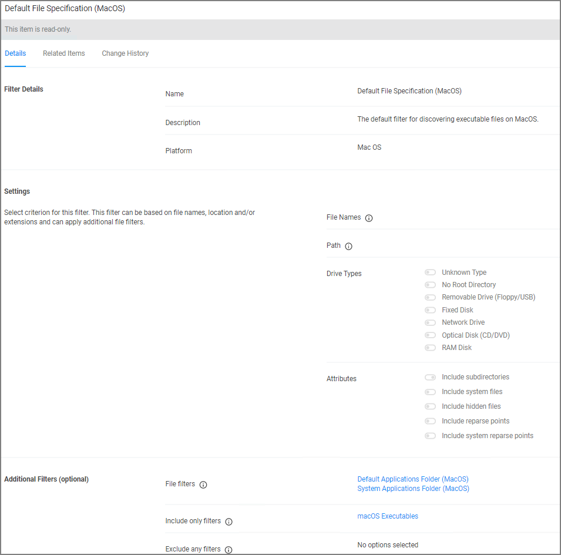
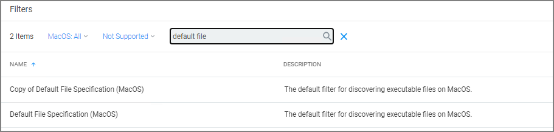

[title]: # (Default File Specification)
[tags]: # (macOS filter types)
[priority]: # (4)
# Default File Specification (MacOS)

This filter identifies files based on their file path or location on a computer.

This filter is available for macOS systems.

By default this is a read-only filter which uses the following Additional Filters:

* File filters:

  * [System Applications Folder (MacOS)](sys-app-folder.md)
  * [Default Applications Folder (MacOS)](def-app-folder.md)

* Include only filters:

  * [macOS Executables](macos-exe.md)

The option to include subdirectories is enabled by default.

## Example

1. Navigate to __Admin | Filters__.
1. In the search field next to the supported/not supported OS drop-downs, search for _default file_.

   
1. Select the __Default File Specification Filter (MacOS)__ filter to view its details and/or create a copy to customize the filter.
1. Click __Duplicate__.
1. Set the needed parameters.
1. Click __Save Changes__.
