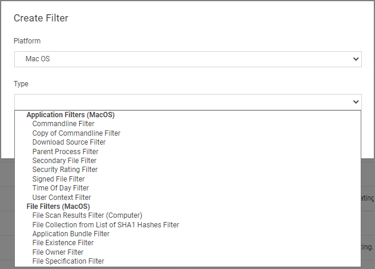

[title]: # (MacOS)
[tags]: # (filter types)
[priority]: # (2)
# MacOS Specific Filters

Most of the Application and File type filters apply to Windows as much as macOS platforms. There are some macOS specific filters that are covered in this section.

This is the default drop-down list when adding a new filter for macOS:

### Creating macOS Filters Manually

In cases when Privilege Manager does not have enough information from the discovery process on a macOS endpoint, filters have to be created manually.

To manually find granular information required for targeting applications in Privilege Manager on a macOS endpoint,

1. Right-click the target application and select __Show Package Contents__.
1. Navigate to __Contents | Info.plist__, this gives you a coded list of items that you can match into the details page of your Filter.  
  
For example, the highlighted section below can be entered into the __Bundled Identifier__ line item when creating a Firefox filter.  

## List of MacOS Filters

The following filters are available based on type from a quick select drop-down menu, after choosing macOS as the platform.

### Application Filter Types

* [Commandline Filter](../application/cmdline.md)
* [Download Source Filter](../application/download-source.md)
* [Parent Process Filter](../application/parent-process.md)
* [Secondary File Filter](../application/sff/secondaryfilefilters.md)
* [Security Rating Filter](../application/security-ratings.md)
* [Signed File Filter](../application/signed-file.md)
* [Time Of Day Filter](../application/time-of-day.md)
* [User Context Filter](../application/user-context.md)
  * [Leveraging the User Context Filter for NoMAD](user-context-nomad.md)

### File Filter Types

* [Application Bundle Filter](app-bundle.md)
* [File Collection from List of SHA1 Hashes Filter](../inventory/file-collect-list-sha1-hash.md)
* [File Existence Filter](../file/file-existence.md)
* [File Owner Filter](../file/file-owner.md)
* [File Scan Results Filter (Computer)](../inventory/file-scan-results-comp.md)
* [File Specification Filter](../file/file-specification.md)

## List of Default Filters for Event Discovery

The following filters are the default filters used during inventory event discovery on macOS endpoints:

* [Default File Specification (MacOS)](file-specification.md)
  
  * [Default Applications Folder (MacOS)](def-app-folder.md)
  * [System Applications Folder (MacOS)](sys-app-folder.md)
* [Default App Bundles File Specification Filter](def-app-bundle-fs.md)

  * [Default Application Bundles Filter (MacOS)](def-app-bundle.md)
  * [System Application Bundles Filter (MacOS)](sys-app-bundle.md)

## Available Preference Pane Filters

* [Date and Time Preference Pane filter](prefpane/date-time.md)
* [Energy Saver Preference Pane filter](prefpane/eng-saver.md)
* [Network Preference Pane filter](prefpane/network.md)
