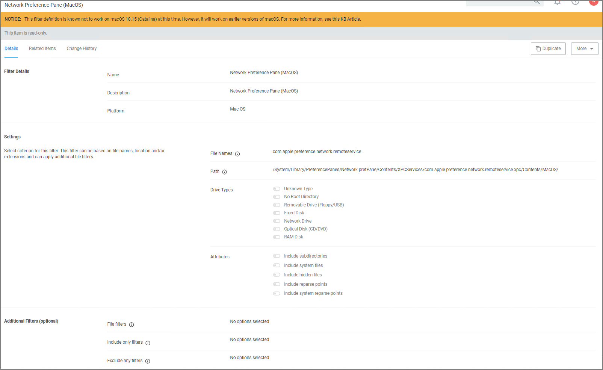

[title]: # (Network)
[tags]: # (macOS filters)
[priority]: # (5)
# Network Preference Pane Filter

The Network Preference Pane Filter is a read-only filter. If you need to customize the filter, create a copy and edit Settings and/or add Additional Filters.

Once you create a duplicate, you can edit the default file names and path details. You can further specify to limit the targeting to specific drive type only based on selection, by default Thycotic does not add any limitations here. Selecting Attributes allows to widen the default scope of the filter.
