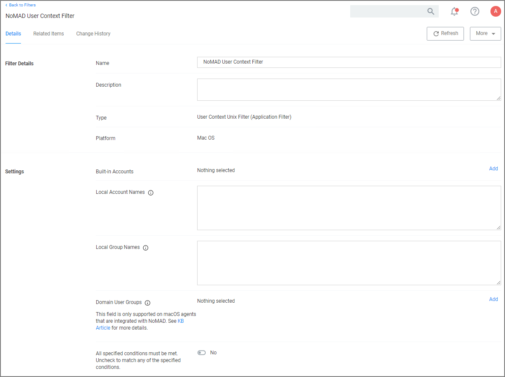
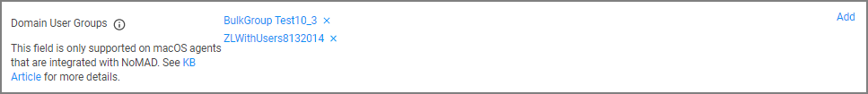

[title]: # (User Context for NoMAD)
[tags]: # (filter types)
[priority]: # (8)

# Levering the User Context Filter for NoMAD

Domain group memberships on macOS agents integrated with NoMAD can be targeted with a specific User Context filter.

1. Navigate to __Admin | Filters__.
1. Click __Create Filter__.
1. From the __Platform__ drop-down, select __Mac OS__.
1. From the __Type__ drop-down, select __User Context Filter__.
1. Name your filter to later search and easily find it for inclusion in policies.
1. Click __Create__.

   
1. Under __Settings | Domain User Groups__, click __Add__.
   1. On the __Select Resources__ modal, enter a resource name for the search. Any group with the entered term in the name will be returned. If no name is entered all domain groups will be returned.
   1. Click __Search__.
   1. On the page with the list of returned resources, select the NoMAD integrated groups for this User Context Filter and click __Select__.
1. Click __Save Changes__.

You User Context Filter now contains the groups you associated with this filter, for example:

>**Note**: If no groups are shown after the select resources search, you might have to run the Active Directory sync task to update available users and group.
