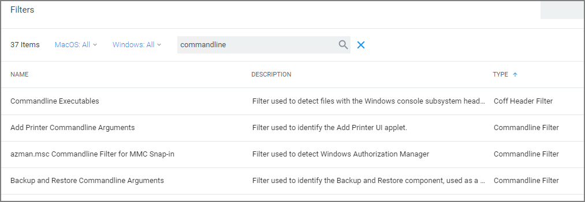

[title]: # (Advanced Commandline)
[tags]: # (filter types, *nix)
[priority]: # (3)
# Advanced Commandline Filter

These filters will perform an exact, partial or regex match on the commandline of the process.

<!--Privilege Manager comes with default commandline filter types, which are all read-only, but can be copied to be customized.

This filter is available for both Windows and macOS systems.

## Search for Commandline Filters

1. Navigate to __Admin | Filters__.
1. In the search field for the __Type__ column enter commandline.

   
1. Select a filter to view its details and/or use __Duplicate__ to customize the filter.

   

   If you Duplicate (make a copy of an existing) filter, "rename" the filter and click __Create__.

   
-->

## Create a new Advanced Commandline Type Filter

1. Navigate to __Admin | Filters__.
1. Click __Create Filter__.
1. On the New Filter page, select the platform. For this example, select __Unix/Linux__.
1. From the __Filter Type__ drop-down select __Advanced Commandline Filter__.
1. Enter a name and description and click __Create__.

   
1. Customize the newly created filter, click __Add Command__.

   
1. Enter a __Command__.
1. Enter __Arguments__.
1. Enter a __Replacement__.
1. Click __Save Changes__.

<!-- ## Parameters

Commandline Filters have one section to set the parameters for the filter.

The __Match Type__ gives you the options:

* Exact Match
* Partial Match
* Regular expression

__Command Line__:

* This is the section where you enter in the given command parameters to pull up the file or action.

## Examples

A commandline filter examines the commandline (excluding the primary executable) and applies a pattern match (Exact, Partial or Regular Expression).

For example allowing /FlushDNS as a command for IPConfig. -->
