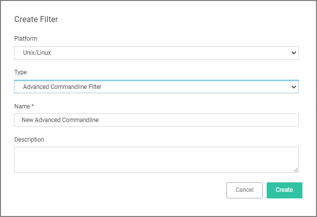
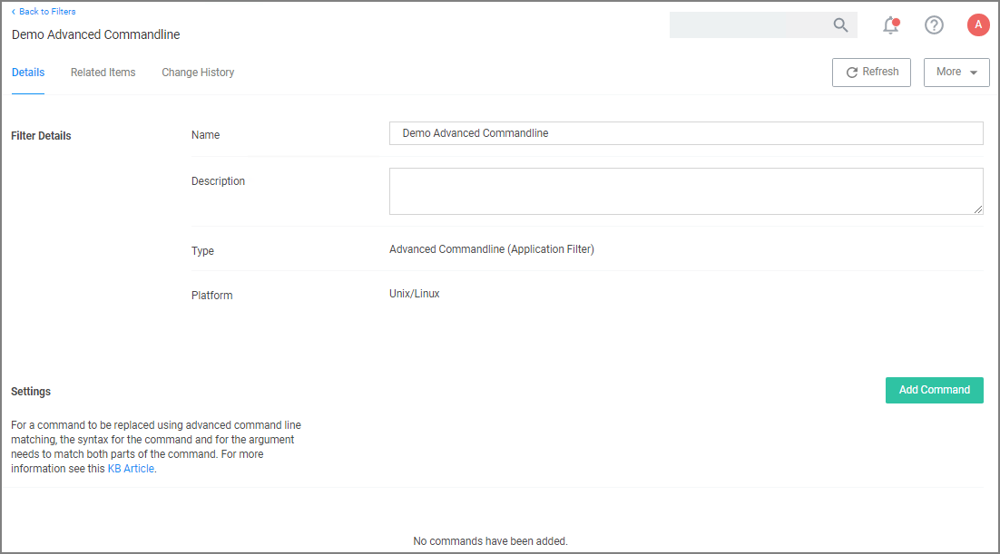
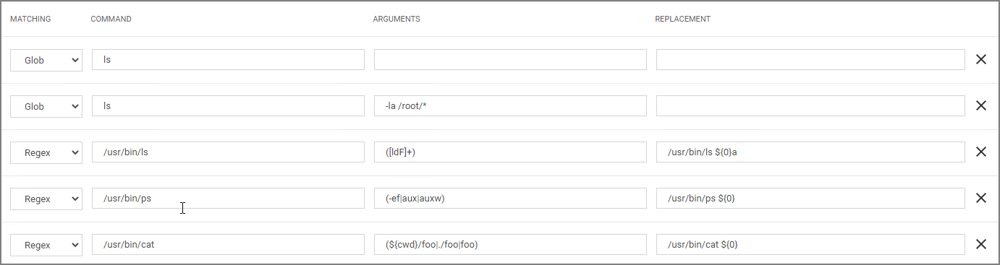

[title]: # (Advanced Commandline)
[tags]: # (filter types, unix/linux)
[priority]: # (3)
# Advanced Commandline Filter

This filter performs a Glob or RegEx match on the commandline submitted by Unix\Linux agent via sudo or pmsh.
Commands can then be executed as they have been submitted or the filter has the ability to re-write the executed command via the Replacement field of the Command.

When adding commands, the Glob or RegEx is matched:
* Glob for simple filename matches such as *
* RegEx for advanced searches and matches of patterns in files such as ${pwd}

The command match is based on the command source, such as from the agent:

* The submitting user would only type a command such as sudo id, although the agent will submit the full path of the command such as `/usr/bin/id`.
* For security the command should be defined with the full executable path such as `/usr/bin/id` or `/bin/id`.

## Arguments

Allows more specific command submission matching from the agent such as `ls -l /root/*`.

## Replacement

Rewrites the submitted command being executed on the Unix\Linux Agent

## Creating a new Advanced Commandline Type Filter

1. Navigate to __Admin | Filters__.
1. Click __Create Filter__.

   
1. On the New Filter page, select the platform. For this example, select __Unix/Linux__.
1. From the __Filter Type__ drop-down select __Advanced Commandline Filter__.
1. Enter a name and description and click __Create__.

   
1. Customize the newly created filter, click __Add Command__.

   
1. Select the matching type, Glob or RegEx. Use Glob for filename matches and RegEx for searches amd matches of patterns in files.
1. Enter a __Command__.
1. Enter __Arguments__.
1. Enter a __Replacement__.
1. Click __Save Changes__.

## Examples

A commandline filter examines the commandline (excluding the primary executable) and uses either Glob or RegEx for the pattern match. Here are examples for both options:

### Example of Commandline Replacements

Command: `restart`
Arguments: `pmagent`
Replacement: `/usr/bin/systemctl restart pmagent`
User submits: `sudo restart pmagent`
Command executed: `/usr/bin/systemctl restart pmagent`

## Limitations of the Advanced Commandline Filter

The command re-write is done BEFORE any action defined in the Policy, therefore commands that will also display actions assigned to the policy such as `runas user` and environment variable will not be displayed as expected, because the commandline filter is processed before the action.
