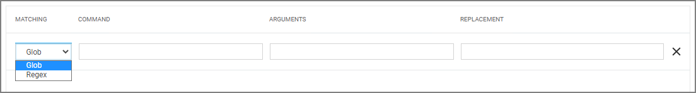

[title]: # (Advanced Commandline)
[tags]: # (filter types, unix/linux)
[priority]: # (3)
# Advanced Commandline Filter

This filter performs a glob or RegEx match on the commandline of the process.

## Create a new Advanced Commandline Type Filter

1. Navigate to __Admin | Filters__.
1. Click __Create Filter__.

   
1. On the New Filter page, select the platform. For this example, select __Unix/Linux__.
1. From the __Filter Type__ drop-down select __Advanced Commandline Filter__.
1. Enter a name and description and click __Create__.

   
1. Customize the newly created filter, click __Add Command__.

   
1. Select the matching type, Glob or RegEx. Use Glob for filename matches and RegEx for searches amd matches of patterns in files.
1. Enter a __Command__.
1. Enter __Arguments__.
1. Enter a __Replacement__.
1. Click __Save Changes__.

## Examples

A commandline filter examines the commandline (excluding the primary executable) and uses either Glob or RegEx for the pattern match. Here are examples for both options:

