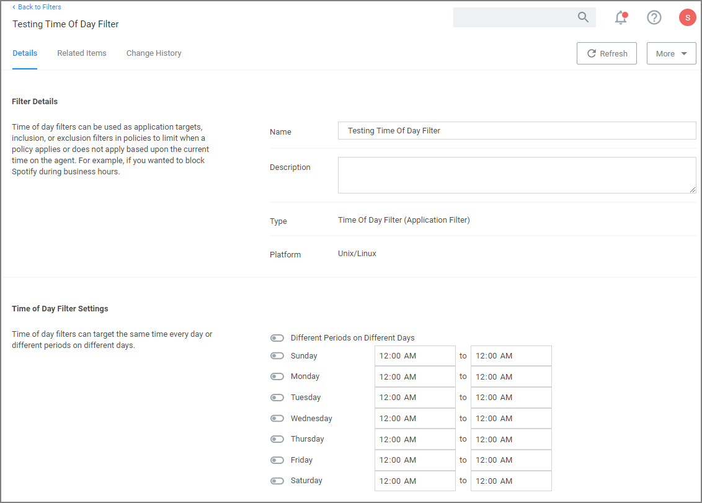
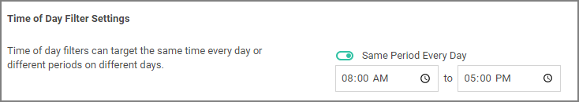

[title]: # (Time of Day)
[tags]: # (unix/linux)
[priority]: # (2)
# Time of Day Filter

This type of filter exists to create policy parameters for specific time frames.

This filter is available for all supported platforms.

## Parameters

The time of day filter has two different settings to allow you to set time and day allowances.

Flip the switch to toggle between these option:

* __Different Periods on Different Days__ (default). When set to Different Periods on Different Days, the page also shows switches to turn on the time of day settings for the specific day of the week. By default no periods are enabled.
* __Same Period Every Day__, when turned ON only one period entry option is available

  

Save the changes after any customization.
## Examples

You can use the time of day filter in a policy to only pickup specific times or days of the week.
