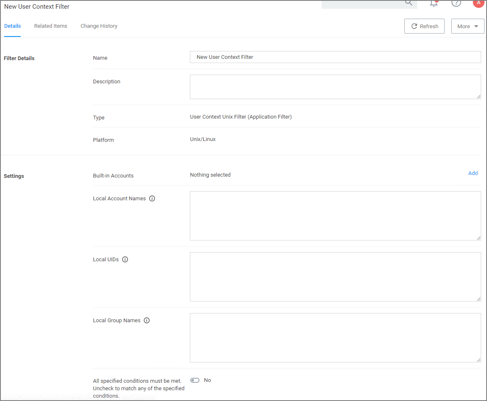

[title]: # (User Context)
[tags]: # (sid,*nix)
[priority]: # (2)
# Using User Context Filters

User Context Filters are used in a policy as either an

* inclusion filter, to specify that the policy only applies to users in a specific AD Group.
* exclusion filter, to specify that the policy applies to everyone, except the users in a specific AD Group.

The User Context Filters are part of the Application Filter templates:

This filter is available for all supported OSs.

## On-Premise

For Privilege Manager on-premises the __User Context Filter__ can be used after the Active Directory synchronization completes. When creating and editing the filter, add any of the following information can be specified to identify the user context.

* Built-in Accounts: Use __Add__, then select a resource and click __Select__.
* Local Account Names: If entering multiple account names, each entry must go on a new line.
* Local UIDs: If entering multiple UIDs, each entry must go on a new line.
* Local Group Names: If entering multiple local group names, each entry must go on a new line.

1. Select if __ALL__ conditions must be met. Leave the box unchecked to match __ANY__. You can also specify if accounts must be enabled to be targeted. This is an important checkbox to set if specific users have been added.
1. Click __Save Changes__ to save any customization of the filter.

<!--## Cloud

For Privilege Manager cloud the __User Context Filter via SID__ can be used if (Azure) AD synchronization has not been set up but the SID of the group is known. When creating the filter, enter the

* Group SID , and
* Group Name, to name the group if it does not exist.

 -->
