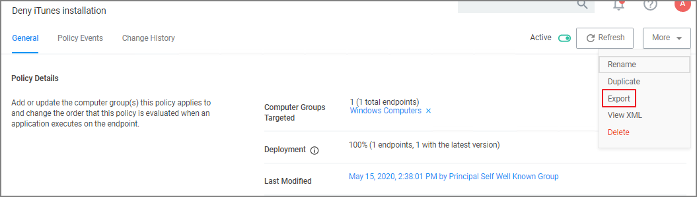
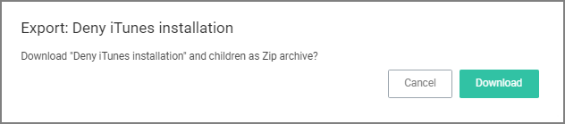
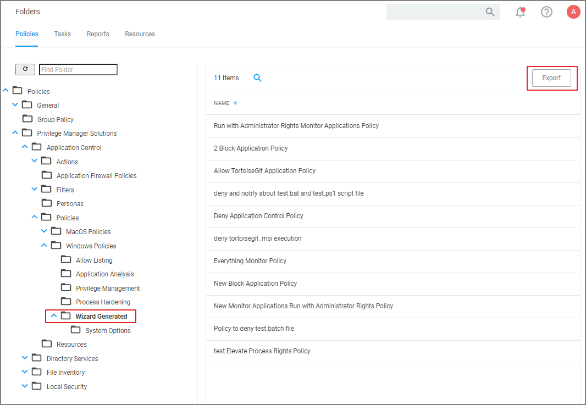
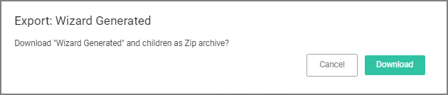

[title]: # (Export Items)
[tags]: # (overview)
[priority]: # (7)
# Export Items

In Privilege Manager Administrators need the ability to export complete policies, including dependent filters, actions, resource targets and any related items. They also need the ability to then import those policies into another instance.

The export and import feature can be used for production environments with multiple instances and for troubleshooting purposes when assistance is needed.

The feature provides the ability

* to export single policies for specific troubleshooting purposes.
* to bulk export via policies folders at any given folder level, except on root folders, depending on specific needs.
* to choose to overwrite or leave in place what's already there.
* to select specific objects or bulk select

This feature supports the bulk migration and creation of policies, including all of their dependencies.

## Exporting Items

Items at various levels of complexity can be exported. The UI offers several access points for an export operation.

### Specific Policy Export

To export a specific policy with dependent filters and actions:

1. Navigate to the specific Policy and select it.
1. From the top-right __More__ menu select __Export__.

   
1. A modal opens asking the user to confirm the download of the specific policy.

   

   Click __Download__.

   The policy is downloaded to your system's default download location as a .zip file

The policy details are downloaded in a zip file named after the policy name that was selected for export. The zip file contains one items.xml file with all the exported data. Extract the zip file and open/edit the exported xml.

The export of filters, tasks, or reports is done in a similar way, by navigating to the specific item, locating the Export button and proceeding through the export process steps.

### Folder Exports

Bulk export of items is possible via the Folders page.

1. Navigate to __Admin | Folders__. The export of folders is available on the Policies, Tasks, and Reports. On the Resources tab, the export is only possible for Resource Filters.
1. From the folders tree select any of the available folders.

   

   Click __Export__.
1. A modal opens asking the user to confirm the download of the specific policy.

   

   Click __Download__.

The items are downloaded in a zip file named after the folder that was selected for export. The zip file contains one items.xml file with all the exported data. Extract the zip file and open/edit the exported xml.