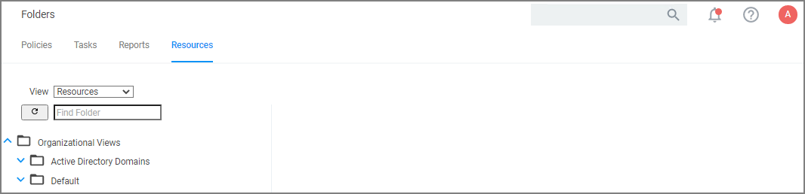

[title]: # (Folders)
[tags]: # (overview)
[priority]: # (7)
# Folders

The Folders area contains all the resource items available by default and custom created in Privilege Manager. It provides an overview for each major items group.

## Policies Folder Overview

## Tasks Folder Overview

## Reports Folder Overview

## Resources Folder Overview

