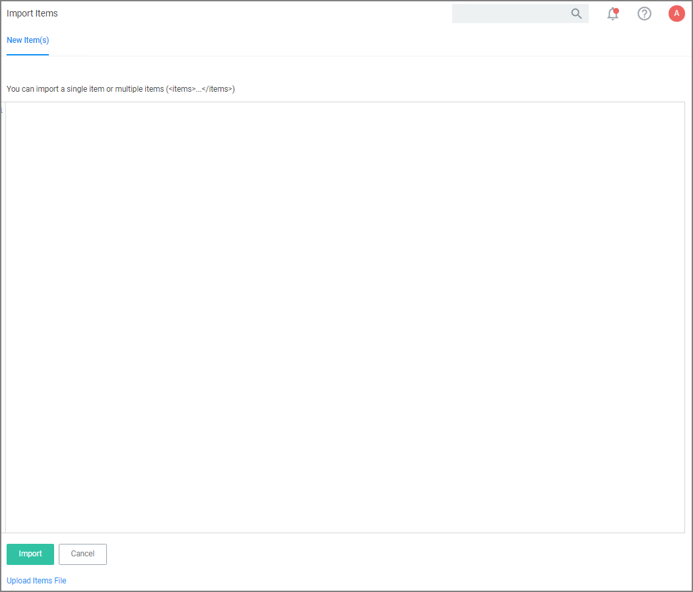
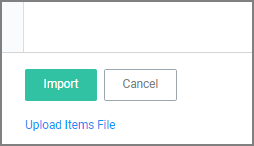
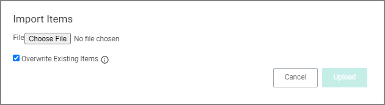

[title]: # (Import Items)
[tags]: # (overview)
[priority]: # (9)
# Importing Items

>**Note**:
>Prior to importing any data into your environment, Thycotic recommends to create a backup of the current Privilege Manager Database.

Items can be imported in different ways, which are further detailed below.

## Using Import Items

1. Navigate to __Admin | Import Items__.
1. The xml viewer opens and you may copy xml item data here to import. Or use the __Upload Items File__ option as described under [Using Diagnostics Upload Items File](index.md#using_diagnostics_upload_items_file).

## Using Diagnostics Upload Items File

To import items via file upload follow these steps:

1. Navigate to __Admin | Diagnostics__ and select __Import Items__.
1. Scroll to the bottom of the page and select the __Upload Items File__ link.

   
1. The __Import Items__ dialog opens, browse to your file location and select the file containing the data to import.

    

   Supported file types for the import are .xslt, .xbl, .xsl, .xml, and .zip.

   By default the __Overwrite Existing Items__ checkbox is selected. If you want to skip items that already exist, un-check the box.
1. Click the __Upload__ button.

You can verify the uploaded data by navigating to __Admin | Folders__. Depending on your import, the data is listed under Policies, Tasks, or Resource Filters.
