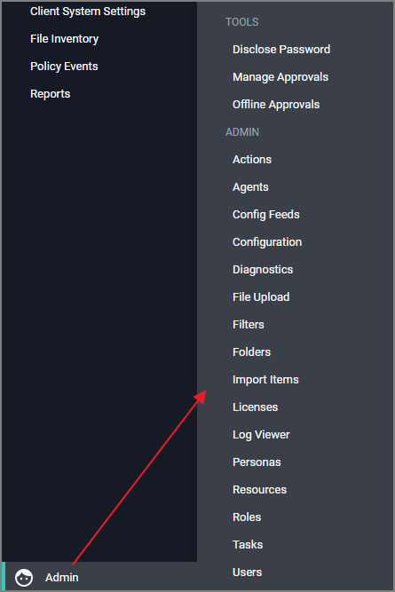

[title]: # (Privilege Manager Administration)
[tags]: # (set-up,admin)
[priority]: # (2100)
# Privilege Manager Administration

Access to many system administration tasks happens via the __Admin__ menu at the bottom of the left navigation menu.

This section of the Privilege Manager documentation covers how to setup and configure resources listed under the Admin Menu. There or other common tasks an Administrator will do like create, edit, and delete policies, filters, and local groups and users, those are detailed further under their respective sections and are not addressed here under Admin procedures.
