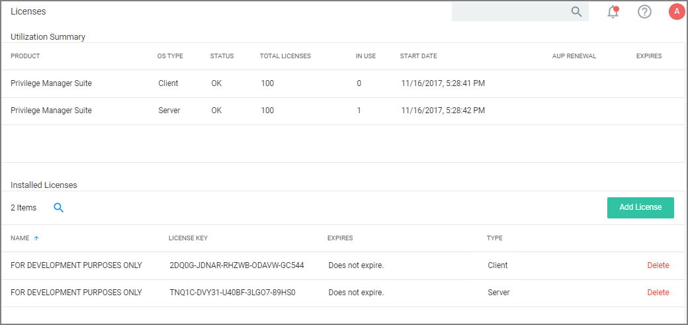
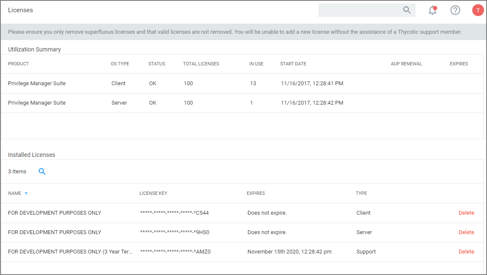

[title]: # (Licenses)
[tags]: # (overview)
[priority]: # (10)
# Licenses

For details about License setup etc., refer to [Getting Started | Licensing](../../getting-started/licenses.md).

## On-Premises

For On-prem instances licenses can be added and deleted by users with Privilege Manager Administrators' roles.

The Add License button is always available, independent of a potential integration with Secret Server.

When licenses are added the __Licensing Update__ task should be run manually to immediately update any gauges and reports with the correct number.

## Cloud

For Cloud instances, licenses can be deleted by users with Privilege Manager Administrators' roles.

Cloud licenses can only be added by Thycotic support members.
