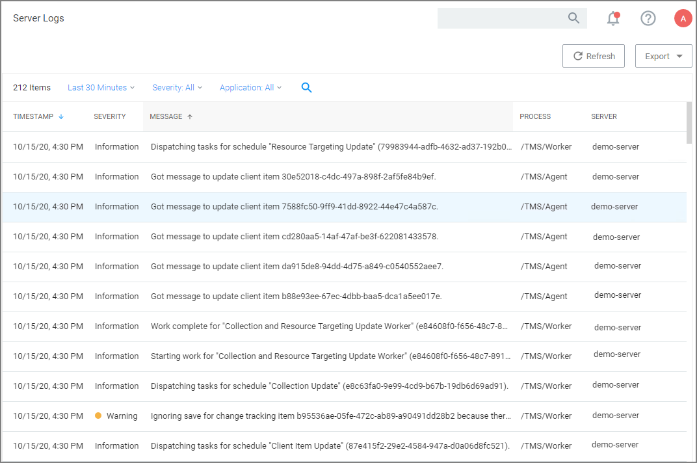
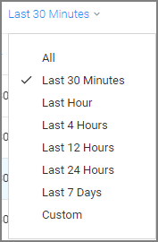
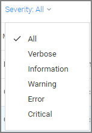
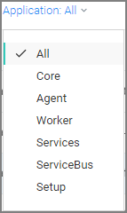
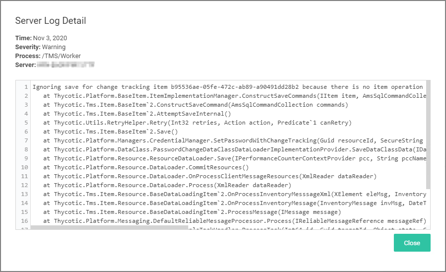
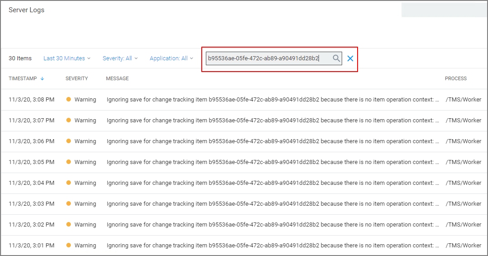

[title]: # (Server Logs)
[tags]: # (overview)
[priority]: # (10)
# Server Logs

The Server Logs provide insight into the Privilege Manager Server Logs.

By default the Server Logs are shown for the last 30 minutes and with the Severity and Application set to All. These change be changed via the available drop-down options:

| Drop-downs | Options |
| ----- | ----- |
| Duration |  |
| Severity |  |
| Application |  |

## Details

The Server Logs are searchable via CorrelationID for better troubleshooting support. Details for a log entry can be viewed by clicking on the row containing the entry.

## Search by CorrelationID

If you are looking for all events pertaining to the same ID, you copy the id and enter it in the table grid search field.

