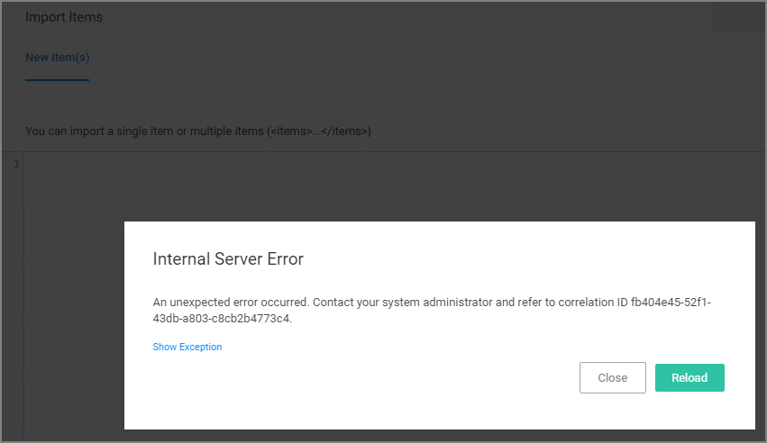
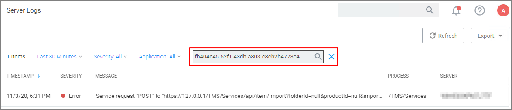
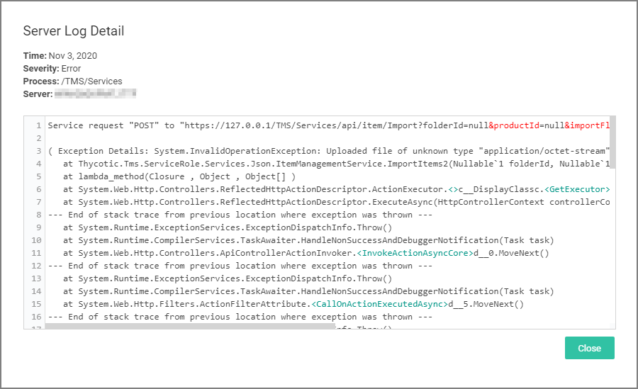

[title]: # (Server Logs)
[tags]: # (overview)
[priority]: # (10)
# Server Logs

The Server Logs provide insight into the Privilege Manager Server Logs.

By default the Server Logs are shown for the last 30 minutes and with the Severity and Application set to All. These change be changed via the available drop-down options:

| Drop-downs | Options |
| ----- | ----- |
| Duration |  |
| Severity |  |
| Application |  |

## Details

Details for a log entry can be viewed by clicking on the row containing the log entry.

## Search by CorrelationID

The Server Logs are searchable via CorrelationID for better troubleshooting support. If you are looking for log details about an error that occurred in the UI, copy the CorrelationID from the error message and enter it in the table grid search field.

* Error providing CorrelationID:

  
* Search Server Logs for CorrelationID:

  
* Details for error based on CorrelationID search:

  
