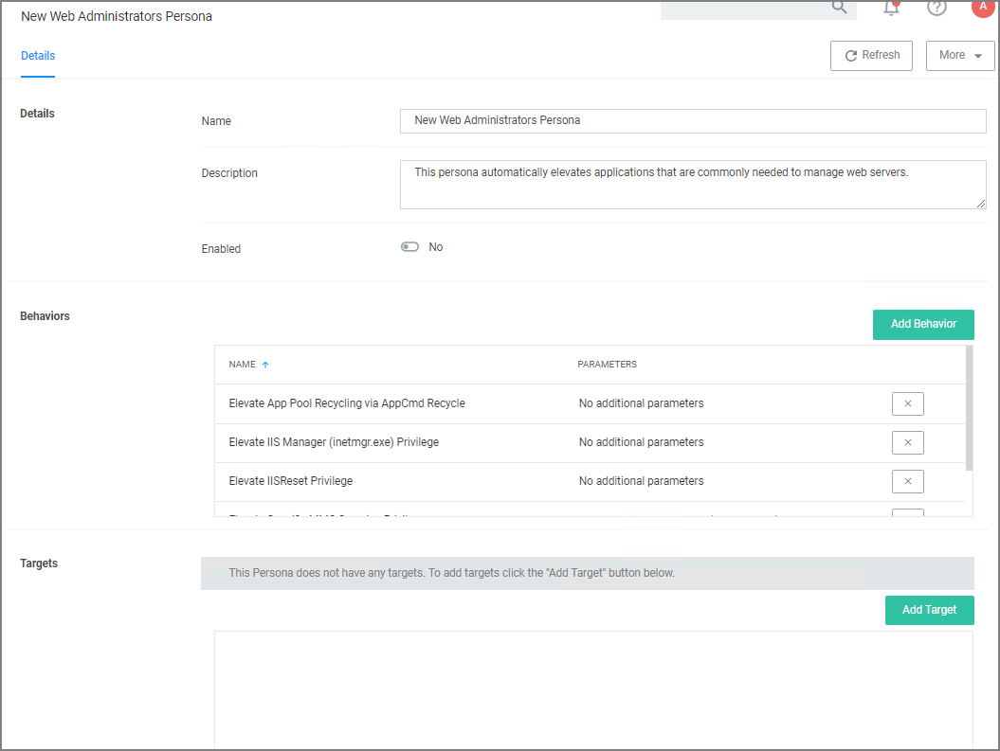

[title]: # (Personas)
[tags]: # (overview)
[priority]: # (11)
# Personas

In Privilege Manager, Personas are collections of privileges for specific roles at an organization. You can assign Personas to users on a specific Computer Group to elevate their identity to perform specific tasks.

For example: A "SQL Administrator" Persona might be created that assigns rights to launch Certificate Manager and SQL Server Configuration Manager. Only users under this Persona would be allowed to execute these applications on your network.

>**Note**:
>It is recommended to setup Active Directory Synchronization first and run the synchronization task to then easily assign Personas to domain user groups.

## Viewing your Personas

To see all your Personas navigate to __Admin | Personas__. From the Windows Privilege Personas page, you can create new Personas and manage existing Personas.

## Creating a Persona

To create a Persona, click __Create Persona__. You will be presented with a dropdown list of Persona Templates to choose from.

| Personas Template | Description |
| ----- | ----- |
| Custom Persona | An empty Persona template for the users to customize based on their needs. |
| Network Administrators Persona | Automatically elevates applications that are commonly needed to manage network configurations. Elevate DHCP, DNS, and NLB Configuration |
| Security Administrators Persona | Automatically elevates applications that are commonly needed to manage local users and security settings. Elevate Local User and Groups and Group Policy Object Editor |
| SQL Administrators Persona | Automatically elevates applications that are commonly needed to manage SQL servers. Elevate Certificate Manager, ODBC Configuration, and SQL Server Configuration Manager |
| Storage Administrators Persona | Automatically elevates applications that are commonly needed to manage file storage settings. Elevate Disk Defragmentation, Disk Management, ISCSI Connection Configuration, Quota Management, Shared Folders, and Windows Backup |
| Web Administrators Persona | Automatically elevates applications that are commonly needed to manage web servers. Elevate App Pool Recycling, Certificate Manager, IISReset, and adding TCP Firewall Rules |

Select a Persona Template and then provide a Name and Description. Once you are ready to proceed, click Create. If you selected any Persona Template other than Custom Persona then you will have pre-populated Behaviors that you can choose to delete or keep. Otherwise, you will start with a blank Persona.

For Persona Settings, you can change the name, description, and whether the Persona will be enabled. For Persona Behaviors, you can click Add Behavior and choose which privilege(s) you want to allow for this Persona. Finally, for Persona Targets you can choose which Active Directory Domain User Groups this Persona will affect and on which Active Directory Organizational Units this Persona will apply.

Set the persona to __Enabled__ and click __Save Changes__ to finish creating your Persona.
