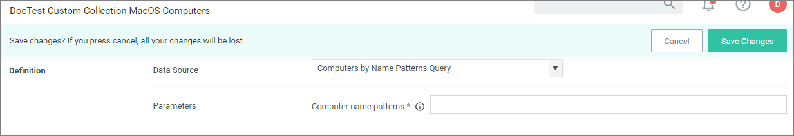

[title]: # (Custom Data Collections)
[tags]: # (resources,query)
[priority]: # (13)

# Custom Data Collections

If users are looking for a specific list of computers to target, SQL wildcard characters can be used in the search and then create a custom collection based on the results. Any data source collection created via search, is signed and can be used for cloud imports.

For example, if a company has their computer resources around the globe set up to have geo location references like EU, AS, US, etc. as a pre- or postfix, collections can be created for all machines in either Europe, Asia, or the United States based on those characters in the computer names.

The query for creating a custom data collection is __Computer by Name Pattern Query__, which is available for macOS, Unix/Linux, and Windows collections.

A collection using that query can be created in the following ways:

* using __Create__ on the Resources page, or
* duplicating a read-only or editing any existing collection previously created.

## Creating a Custom Data Collections by Duplication

1. Navigate to __Admin | Resources__.
1. From the __Collections__ folder select either MacOS, Unix/Linux, or Windows.
1. Select an existing collection from the list, for example all __macOS Computers__ and click __View__.
1. Click __Duplicate__ since it is a read-only item.
1. Enter a name and click __Create__.
1. Select __Filter Definition__.
1. From the __Data Source__ drop-down, select __Computer by Name Pattern Query__.

   
1. In the __Computer name patterns__ field, enter one or more comma-separated computer name patterns. 

   For example, _EU-%,%123,SRV-%01_
   * would select all computers that started with _EU-_,
   * include all computer names that end with _123_,
   * and all that start with _SRV-_ but must end with _01_.
1. Click __Save Changes__.
1. Select __Membership__.
1. Click __Update Membership__ to immediately run the __Collection and Resource Targeting Update__ task. This task is assigned to a shared schedule "Collection Update", which runs every 15 minutes by default.

## Using Create on the Resources Page

1. Navigate to __Admin | Resources__.
1. Click __Create__.
1. From the __Template__ drop-down, select __Query Collection__.
1. Enter a name and edit the description to better identify the purpose of the resource you are creating.
1. From the __Query__ drop-down, select __Computer by Name Pattern Query__.

   
1. Click __Create__.
1. Select __Filter Definition__.
1. In the __Computer name patterns__ field, enter one or more comma-separated computer name patterns. 

   For example, _EU-%,%123,SRV-%01_
   * would select all computers that started with _EU-_,
   * include all computer names that end with _123_,
   * and all that start with _SRV-_ but must end with _01_.
1. Click __Save Changes__.
1. Select __Membership__.
1. Click __Update Membership__ to immediately run the __Collection and Resource Targeting Update__ task. This task is assigned to a shared schedule "Collection Update", which runs every 15 minutes by default.
