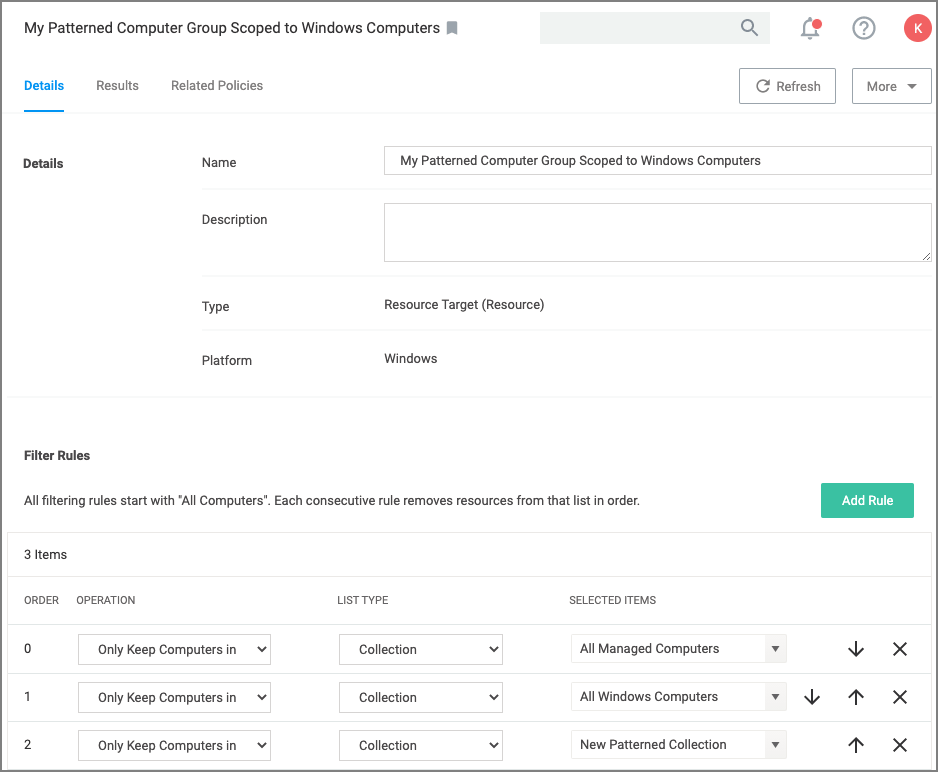

[title]: # (Custom Data Collections)
[tags]: # (resources,query)
[priority]: # (13)

# Custom Data Collections

If users are looking for a specific list of computers to target, SQL wildcard characters can be used in the search and then create a custom collection based on the results.

For example, if a company has their computer resources around the globe set up to have geo location references like EU, AS, US, etc. as a pre- or postfix, collections can be created for all machines in either Europe, Asia, or the United States based on those characters in the computer names.

The query for creating a custom data collection is __Computer by Name Pattern Query__, which is available for macOS, Unix/Linux, and Windows collections.

## Creating a Custom Data Collection Query

1. Navigate to __Admin | Resources__.
1. Click __Create__.
1. From the __Template__ drop-down, select __Query Collection__.
1. Enter a name and edit the description to better identify the purpose of the resource you are creating.
1. From the __Query__ drop-down, select __Computer by Name Pattern Query__.

   
1. Click __Create__.
1. Select __Filter Definition__.
1. In the __Computer name patterns__ field, enter one or more comma-separated computer name patterns.

   For example, _EU-%,%123,SRV-%01_
   * would select all computers that started with _EU-_,
   * include all computer names that end with _123_,
   * and all that start with _SRV-_ but must end with _01_.
1. Click __Save Changes__.
1. Select __Membership__.
1. Click __Update Membership__ to immediately run the __Collection and Resource Targeting Update__ task. This task is assigned to a shared schedule "Collection Update", which runs every 15 minutes by default.

## Using the Query for a New Computer Group

To create a new computer group using the new custom collection query, follow these steps:

1. Navigate to __Computer Groups__, click __Create Computer Group__.
1. From the Platform drop-down select the targeted platform for your new group.
1. Enter a Name and Description for your new computer group.
1. Click __Create__.
1. Under __Filter Rules__, from the
   1. __Operation__ drop-down, select __Only Keep Computers in__.
   1. __List Type__ drop-down, select __Collection__.
   1. __Selected Items__ drop-down, select the _Custom Data Collection Query_ you created above.

   >**Note**: Make sure the set of computers created by the Custom Data Collection Query is not filtered by managed computers. If it is a collection filtered by managed computers, the managed computer rule needs to be added as well.

   
1. Click __Save Changes__.
